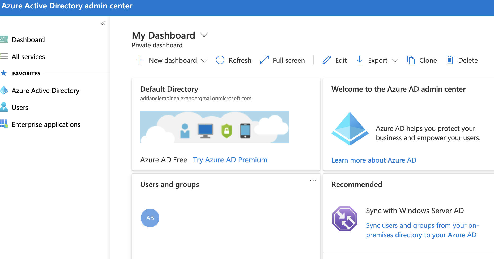
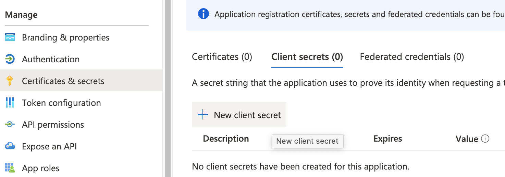
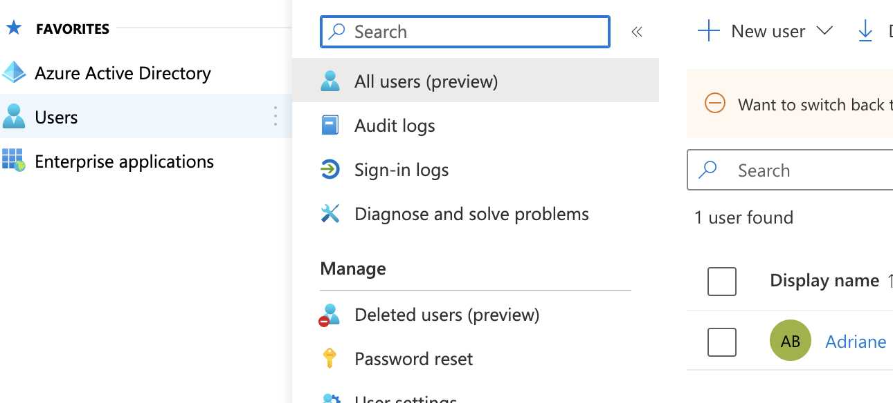
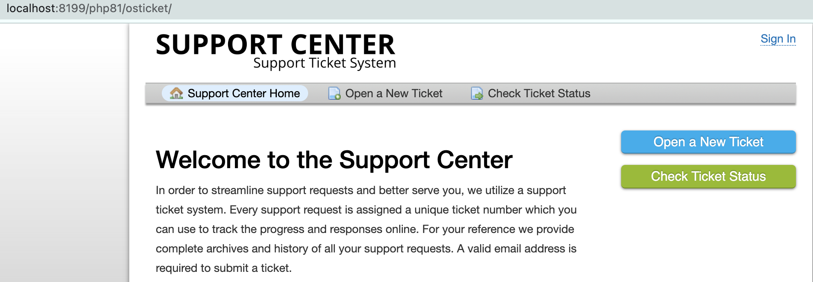
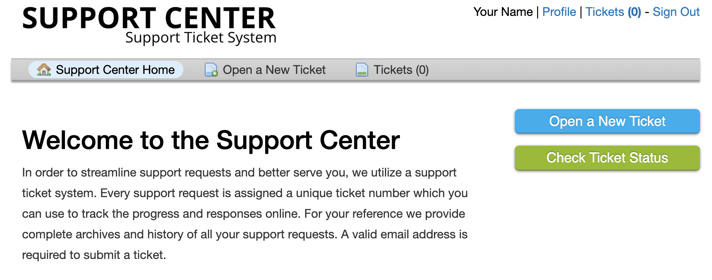

.. |br| raw:: html

     

Microsoft Authentication (SSO) Guide
====================================

Microsoft OAuth allows Agents and Users to sign into the helpdesk with their Microsoft account.

Configuration
-------------

Choose 'Microsoft' in the 'Add New Instance' menu

|br|

Give the instance a name that lets you know which provider is selected and select 'Enabled' for the status.

|br|

Go to the 'Config' tab to set up this provider. Some of the default information will be autofilled.

**Note:** The 'Authentication Label' field is the text that will be displayed to the User or Agent when they sign into the helpdesk.

|br|

Choose an Authentication Target to specify who should be able to use this provider.

.. image:: ../_static/images/oauth-authentication/oauth35_audience.png
  :alt: oauth35_audience

|br|

Now you need to set up an application using your Microsoft account. The first thing you need to do is log in to the `Azure Portal <https://portal.azure.com/#home>`_. which brings you to your Dashboard.

|br|

**Note:** if you see an authentication issue, it means you are a standard user with restricted access.

.. image:: ../_static/images/oauth-authentication/oauth2_tenant_error.png
  :alt: oauth2_tenant_error

|br|

In order to use OAuth, you must have an account with administrative access to a tenant or you must be added to a tenant by an administrator.

Next, you'll need to go to 'Azure Active Directory' and click 'App Registrations'.

|br|

Click 'New Registration'

|br|

|br|

Name the application and choose the supported account types:

**Note:** The supported account type will determine the 'Authorization Endpoint' and 'Token Endpoint' in your osTicket instance.

|br|

The Redirect URI can be found in the plugin instance created in osTicket.

|br|

|br|

Choose Web for the Platform, paste in the Redirect URI, and click Register.

|br|

Once you click Register, it will take you to the Overview for your new Application.

|br|

Copy the 'Application (client) ID and paste it into the Client ID field in your osTicket plugin instance:

|br|

|br|

Go back to Azure and click 'Add a certificate or secret'

|br|

Click 'New Client Secret' to generate a new Client Secret

|br|

Add a secret description and click 'Add'

**Important:** The secret 'Value' will only be shown once. If you lose this value, you will have to generate a new one.

|br|

Copy the value and paste it into the 'Client Secret' field on the osTicket instance:

|br|

Now you will need to get the Endpoint values from Azure. Go back to the 'Overview' tab and click the 'Endpoints' option.

The supported account type chosen will determine the values for the 'Authorization Endpoint' and 'Token Endpoint' in your osTicket instance.

|br|

Single Tenant Endpoints:

|br|

Multitenant Endpoints:

|br|

Multitenant and Personal Accounts Endpoints:

|br|

Personal Microsoft Account Endpoints:

|br|

Copy the 'OAuth 2.0 authorization endpoint (v2)' and paste it into the 'Authorization Endpoint' field in the osTicket instance.

|br|

|br|

Copy the 'OAuth 2.0 token endpoint (v2)' and paste it into the 'Token Endpoint' field in the osTicket instance.

|br|

.. image:: ../_static/images/oauth-authentication/oauth95_ost_token_end.png
  :alt: oauth95_ost_token_end

|br|

The rest of the information should be autofilled in the osTicket instance for you.

|br|

Click 'Add Instance' and make sure you see a confirmation message.

|br|

Now that the setup is complete, you should be able to use your Microsoft account to log into the helpdesk.

Agent Login
-----------

To test the functionality for Agents, go to:

Admin Panel | Agents

|br|

Ensure that you see the provider that was just set up in the list. It is important, however, to make sure you choose **'Use any available backend'** so that you can still log into your helpdesk in the event that OAuth has an error.

**Note:** You must also ensure that the email for the Agent exists in the organization you are setting up OAuth for. You can see your users by going to Azure and clicking the 'Users' tab.

|br|

Log out of the helpdesk and go to the login screen.

|br|

Click the 'Sign in with Azure' button to test the OAuth set up.

**Note:** The sign in button text can be configured by changing the Authentication Label in the osTicket instance setup.

Now you will be prompted to enter your Microsoft account password.

|br|

You may see a screen to allow osTicket to use your Microsoft login for the helpdesk.

|br|

Click Yes and you should be signed into your helpdesk as an Agent.

User Login
----------

For users, logging in with a Microsoft account should create a new User if one does not exist, otherwise, it will log in as an existing User.

|br|

Click 'Sign In'

|br|

Click 'Sign in with Azure'. Now you will be prompted to enter your Microsoft account password.

|br|

Choose your account and you should be logged in as a User.

