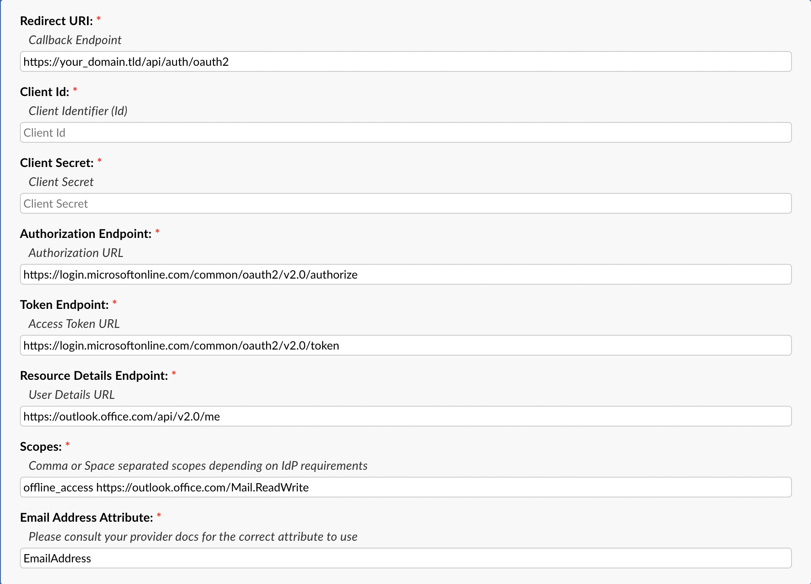
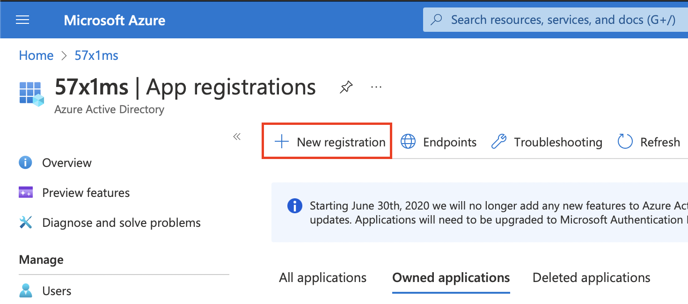
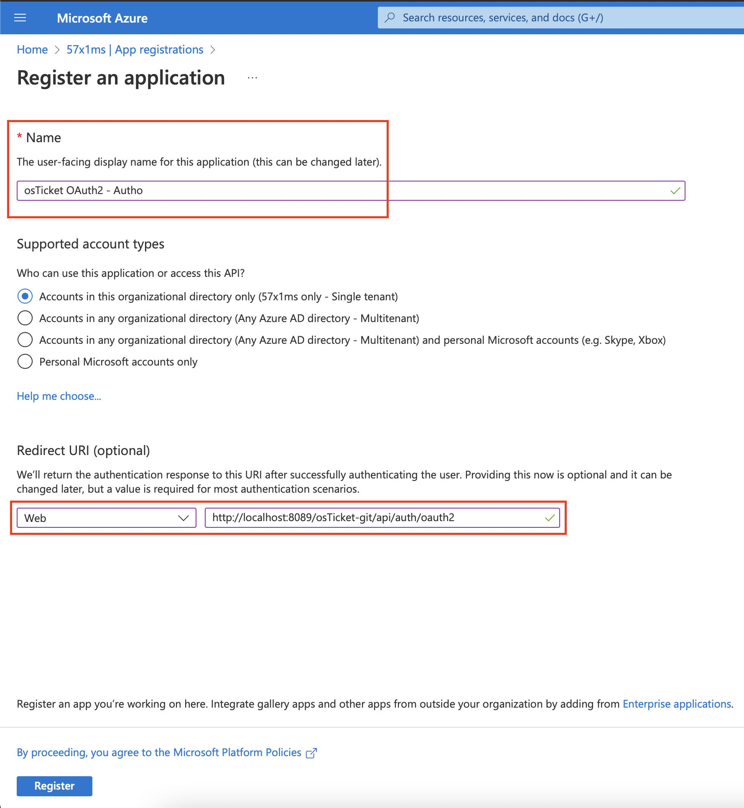
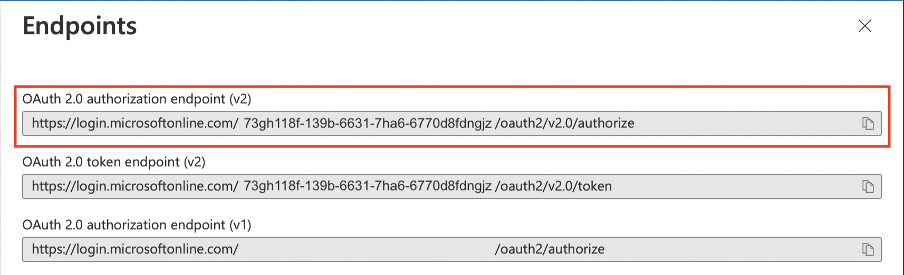

Microsoft Authorization Guide
=============================

This guide will walk you through how to configure Modern Authentication (OAuth2) for a Microsoft email. Please note, you must have the OAuth2 Plugin `installed and enabled beforehand <../Guides/OAuth2%20Guide.html#setting-up-the-plugin>`_.

.. attention::
  Microsoft has started deprecating certain Outlook endpoints used in Modern Authentication (OAuth2) for Emails. Note, this does **not** affect user/agent authentication. These deprecations started causing errors similar to :code:`The API version v2 has been depreciated` when the system attempted to retrieve a new set of Tokens. This prevented new Tokens from being generated which caused authentication failures. We have now made changes to the OAuth2 plugin to support the latest Microsoft deprecations.

  To address this issue, anyone using a Microsoft email as a system email is encouraged to download and install the `latest build of the OAuth2 plugin <https://osticket.com/download>`_ specific to their version of osTicket core. Once downloaded, simply replace your existing OAuth2 PHAR file with the new one. You may want to restart the webserver (and PHP-FPM if you're running it) to clear any server-side file caching. Once complete you can follow the steps below to update your email configurations:

  :doc:`Licensed/Personal Emails <../OAuth2/Microsoft Deprecations 2024/Licensed Personal Emails>`

  :doc:`Shared Mailboxes/Resource Emails/Aliases <../OAuth2/Microsoft Deprecations 2024/Shared Mailboxes Resource Emails Aliases>`

Configure Authorization
-----------------------

**Admin Panel > Emails > Emails > click a System Email**

First we will need to click on a System Email and go to the **Remote Mailbox** tab. Here you will select the **Authentication** method of **OAuth2 - Microsoft**.

.. image:: ../_static/images/ms_oauth2_autho_1.png
  :alt: Remote Mailbox Tab

Once the option is selected you can click the **Config** button. Once the popup appears click the **IdP Config** tab to start configuring OAuth2. Here you will be presented with a form to input information from your provider (Microsoft). Some of the information is prefilled and does not need to be changed. The important thing at this stage is to copy the **Callback Endpoint** (at the top of the popup) to your clipboard for a later step in this guide.

Once you've copied the **Callback Endpoint** let's head on over to `Azure Portal <https://portal.azure.com>`__ (*preferably in a new tab*) to register a new application. In the Azure Portal let's click the **Microsoft Entra ID** service. If you cannot find it on the homepage click **More Services** and search for it.

.. image:: ../_static/images/ms_oauth2_autho_3.png
  :alt: Azure Portal - Mircrosoft Entra ID

Next, click the **App Registrations** tab and then click **+ New registration** to create a new application.

.. image:: ../_static/images/ms_oauth2_autho_4.png
  :alt: App registrations tab

|

This will give you a new blade view to input some basic application information such as the **Name**, **Support account types**, and **Redirect URI**. For **Supported account types** you can select whatever you prefer, for the sake of this guide we will be using the default selection which is the first option (**Accounts in this organizational directory only**). For **Redirect URI** select **Web** and paste the **Callback Endpoint** you copied earlier.

Now click **Register** and wait for the application to be created. Once created, we will click on the **API Permissions** tab and click the **+ Add a permission** button.

.. image:: ../_static/images/ms_oauth2_autho_7.png
  :alt: API permissions

Here you will select the **Microsoft Graph** option and select **Delegated Permissions**.

|

.. image:: ../_static/images/ms_oauth2_autho_9.png
  :alt: Delegated permissions

Here you will search for and enable the following permissions: **User.Read**, **offline_access**, **IMAP.AccessAsUser.All**, **POP.AccessAsUser.All**, and **SMTP.Send**.

.. image:: ../_static/images/ms_oauth2_autho_10.png
  :alt: offline_access permission

.. image:: ../_static/images/ms_oauth2_autho_11.png
  :alt: User.Read permission

.. image:: ../_static/images/ms_oauth2_autho_12.png
  :alt: IMAP.AccessAsUser.All permission

Now you can click **Add Permissions** and wait for the page to refresh. If successful your permissions table should look like the below image.

.. image:: ../_static/images/ms_oauth2_autho_15.png
  :alt: Add Permissions button

|

.. image:: ../_static/images/ms_oauth2_autho_16.png
  :alt: Permissions table

Now you will need to grant Admin Consent to the scopes by clicking the **Grant admin consent for** button and clicking **Yes** in the consent popup.

|

To confirm Admin Consent was granted for the permissions, review the permissions table and confirm it looks like the below image.

Now we can create the Client Secret by clicking the **Certificates & secrets** tab and clicking the **+ New client secret** button.

Once you click **+ New client secret** input a **Description** for the secret, select your **Expires** period, and click **Add**.

.. image:: ../_static/images/ms_oauth2_autho_20.png
  :alt: Add a client secret form

Now it's very important that you copy the secret **Value** by clicking the clipboard icon and save it somewhere for safe keeping. Microsoft only shows you this Client Secret once and will not display or allow you to copy it after this one time.

Once you've copied the Secret **Value** let's head back over to your helpdesk. Once in your helpdesk paste the **Value** in the **Client Secret** field.

Now we can grab the Client ID by going to the Azure Portal, click the **Overview** tab, copy the **Application (client) ID**, go back to the helpdesk, and paste it in the **Client ID** field.

|

Now for the Authorization/Token Endpoints you will need to go back to the Azure Portal, make sure you are still on the **Overview** tab, and click the **Endpoints** tab at the top.

Here you will copy the **OAuth 2.0 authorization endpoint (v2)** value and paste it in the **Authorization Endpoint** field.

|

Next you will copy the **OAuth 2.0 token endpoint (v2)** value in the Azure Portal and paste it in the **Token Endpoint** field.

|

Now with all the information filled in you can click **Submit** and you should be redirected to Microsoft to authorize the connection.

Here it is **very important** to login to the email you are trying to configure in the helpdesk. Once logged in as the system email you are trying to configure, you can opt to Consent on behalf of your organization, and then click **Accept**.

.. image:: ../_static/images/ms_oauth2_autho_21.png
  :alt: Add a client secret form

After this you will be redirected back to the helpdesk and should see a green success banner. To confirm the connection was successful and that you received a token you can click **Config** again and you should see a new tab called **Token** that displays your token information. Now OAuth2 is configured for the email and you can move on to configure the rest of the :doc:`IMAP/POP3 and SMTP information <../Admin/Emails/Emails>`.
