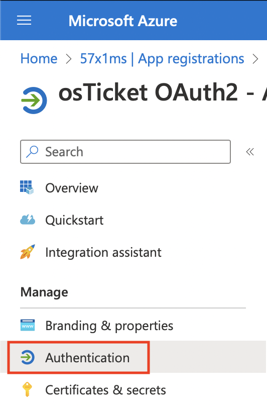

Microsoft Authorization Guide
=============================

This guide will walk you through how to configure Modern Authentication (OAuth2) for a Microsoft email. Please note, you must have the OAuth2 Plugin installed and enabled beforehand.

Configure Authorization
-----------------------

**Admin Panel > Emails > Emails > click a System Email**

First we will need to click on a System Email and go to the **Remote Mailbox** tab. Here you will select the **Authentication** method of **OAuth2 - Google**.

Once the option is selected you can click the **Config** button. Once the popup appears click the **IdP Config** tab to start configuring OAuth2. Here you will be presented with a form to input information from your provider (Microsoft). Most of the information is prefilled and does not need to be changed. The important thing at this stage is to copy the **Callback Endpoint** (at the top of the popup) to your clipboard for a later step in this guide.

.. image:: ../_static/images/ms_oauth2_autho_2.png
  :alt: Configure OAuth2 Form

Once you've copied the **Callback Endpoint** let's head on over to **Azure Portal** (*preferably in a new tab*) to register a new application. In the Azure Portal let's click the **Azure Active Directory** service. If you cannot find it on the homepage click **More Services** and search for it.

Next, click the **App Registrations** tab and then click **+ New registration** to create a new application.

.. image:: ../_static/images/ms_oauth2_autho_5.png
  :alt: App registrations - New registration

This will give you a new blade view to input some basic application information such as the **Name**, **Support account types**, and **Redirect URI**. For **Supported account types** you can select whatever you prefer, for the sake of this guide we will be selecting the third option (Accounts in any org directory and personal accounts). For **Redirect URI** select **Web** and paste the **Callback Endpoint** you copied earlier.

.. image:: ../_static/images/ms_oauth2_autho_6.png
  :alt: Register an application form

Now click **Register** and wait for the application to be created. Once created, we will click on the **API Permissions** tab and click the **+ Add a permission** button.

Here you will select the **Microsoft Graph** option and select **Delegated Permissions**.

.. image:: ../_static/images/ms_oauth2_autho_8.png
  :alt: Request API permissions

Here you will search for and enable the following permissions: **User.Read**, **offline_access**, **IMAP.AccessAsUser.All**, **POP.AccessAsUser.All**, and **SMTP.Send**.

.. image:: ../_static/images/ms_oauth2_autho_12.png
  :alt: IMAP.AccessAsUser.All permission

.. image:: ../_static/images/ms_oauth2_autho_13.png
  :alt: POP.AccessAsUser.All permission

.. image:: ../_static/images/ms_oauth2_autho_14.png
  :alt: SMTP.Send permission

Now you can click **Add Permissions** and wait for the page to refresh. If successful your permissions table should look like the below image.

Once you confirm the permissions are correct click the **Authentication** tab and scroll to the **Implicit grant and hybrid flows** section. Here you will enable both **Access Tokens** and **ID Tokens** and click **Save** to save the changes.

Now we can create the Client Secret by clicking the **Certificates & secrets** tab and clicking the **+ New client secret** button.

.. image:: ../_static/images/ms_oauth2_autho_19.png
  :alt: Clients & secrets - New client secret button

Once you click **+ New client secret** input a **Description** for the secret, select your **Expires** period, and click **Add**.

Now you can copy the secret **Value** and head back over to your helpdesk. Once in your helpdesk paste the **Value** in the **Client Secret** field. Next go back to Azure Portal, click the **Overview** tab, and copy the **Application (client) ID**. Go to your helpdesk and paste this in the **Client ID** field. Now for the Authorization/Token Endpoints you will need to go back to the Azure Portal, click **Overview** tab, and click the **Endpoints** tab at the top. Here you will copy the **OAuth 2.0 authorization endpoint (v2)** value and paste it in the **Authorization Endpoint** field. Next you will copy the **OAuth 2.0 token endpoint (v2)** value and paste it in the **Token Endpoint** field.

Now you can click **Submit** and you should be redirected to Microsoft to authorize the connection.

Here it is **very important** to login to the email you are trying to configure in the helpdesk. Once logged in as the system email you are trying to configure, you can opt to Consent on behalf of your organization, and then click **Accept**.

After this you will be redirected back to the helpdesk and should see a green success banner. To confirm the connection was successful and that you received a token you can click **Config** again and you should see a new tab called **Token** that displays your token information. Now OAuth2 is configured for the email and you can move on to configure the rest of the :doc:`IMAP/POP3 and SMTP information <../Admin/Emails/Emails>`.
