.. |br| raw:: html

     

Attachments in S3
=================

The Attachments in S3 plugin allows you to store attachments in Amazon S3 instead of the database.
This can be a good option to use for helpdesks that have a heavy load of attachments that are taking up a lot of storage in the database.

First, you must download the plugin from `our website <https://osticket.com/download>`_. Please make sure you select the appropriate version of osTicket before proceeding to the plugin selection. Once downloaded, upload the plugin to your server and place it in the :code:`include/plugins/` folder. Make sure the plugin has appropriate file permissions and ownership so the webserver can read and execute.

Now you can install the plugin by logging into your helpdesk and navigating to **Admin Panel > Manage > Plugins**. Click **Add New Plugin** and click **Install** next to the desired plugin.

.. image:: ../_static/images/plugins_add_new.png
  :alt: Add New Plugin

|br|

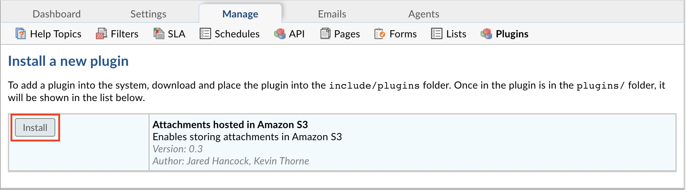

To enable the plugin click on the name of the plugin in the list of installed plugins, set **Status** to **Active**, and **Save Changes**.

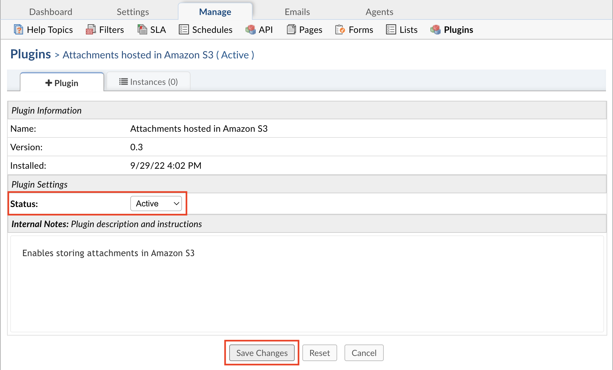

Once the plugin has been installed and enabled, it can be configured by going to:

Admin Panel | Manage | Plugins | Attachments hosted in Amazon S3 | Instances

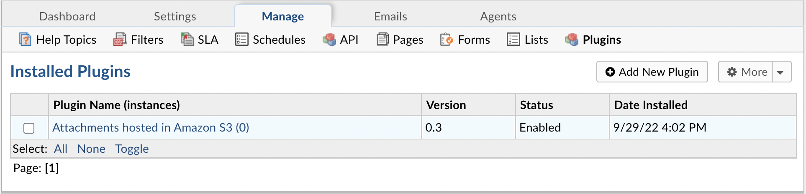

|br|

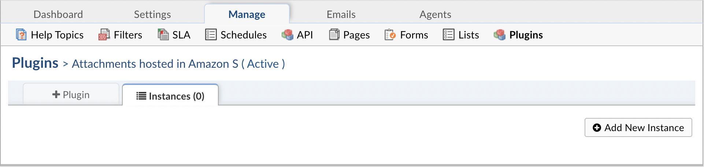

To add a new instance simply click **Add New Instance**. Give the new instance any **Name** you want, set the **Status** to **Active**, and click the **Config** tab to start configuring the instance.

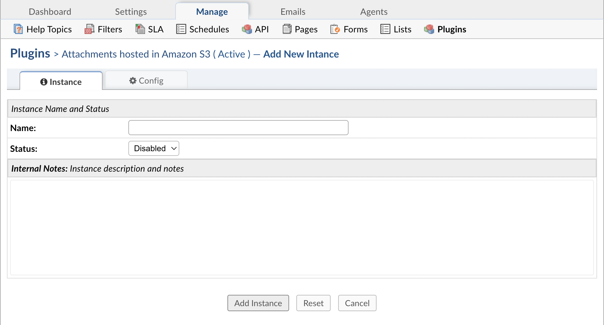

|br|

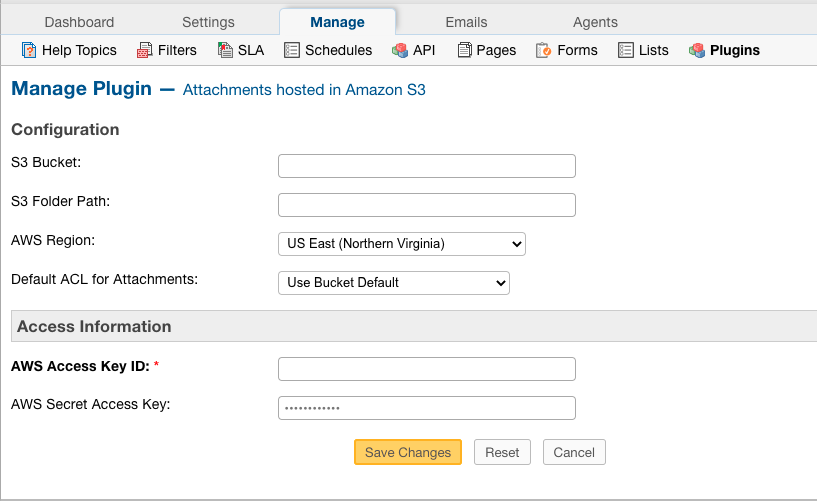

Within the configuration, you will need to provide the **S3 Bucket** to store files in.

The **S3 Folder Path** is an optional field that allows you to specify a folder or folder path within the bucket to store files in.

**Note:** If the folder or folder path provided does not already exist in S3, it will be created automatically.

The **AWS Region** of your bucket can be found in S3 by going to the Bucket and clicking the Properties tab.

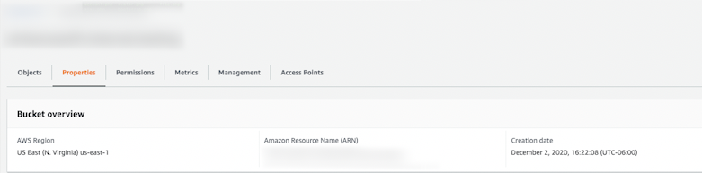

**Default ACL for Attachments** refers to the permissions you want for the files stored in S3. If you aren't sure which option to choose, you can default to the properties already configured for the Bucket.

For the Access Information section, you need to specify IAM user credentials for a user that is set up with access to S3.

Once you have successfully configured the plugin, you will be able to have the helpdesk store attachments in the S3 by going to:

Admin Panel | Settings | System | Store Attachments

Change the 'Store Attachments' option to 'S3'

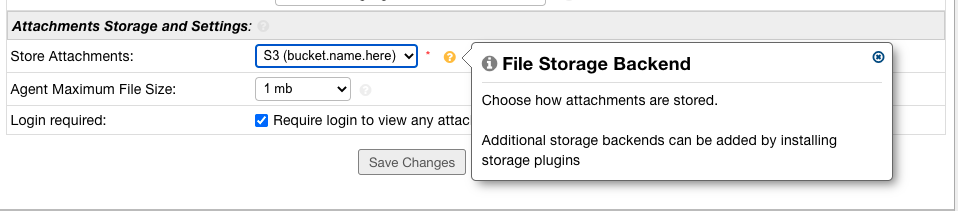

Now, when an Attachment is added in the helpdesk, it will be saved in S3.

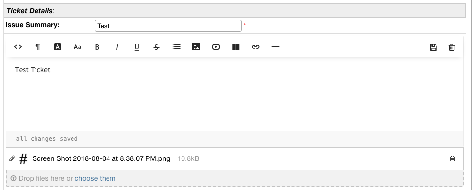

|br|

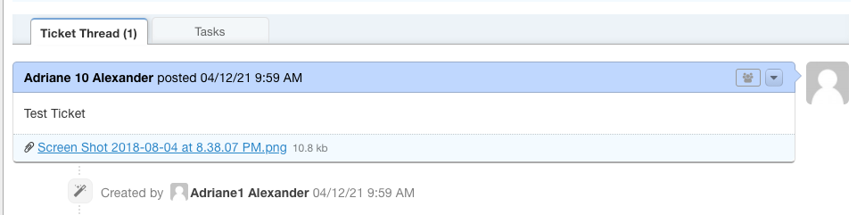

If you have access to the database, you'll notice that attachments stored in S3 can be found in the :code:`ost_file` table, where :code:`ost_` is your table prefix.
If the attachment is successfully stored in S3, there will be a :code:`3` in the :code:`bk` column. Files stored in the database have a :code:`D` in the :code:`bk` column.

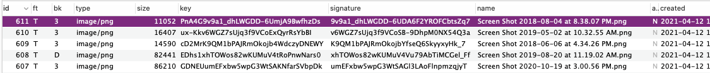

If you have access to the server where the osTicket files are stored, you can see the available backends that can be used by running the following:

:code:`php manage.php file backends`

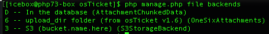

You can migrate the files from the database to S3 by running the following command in the terminal:

:code:`php manage.php file migrate --backend D --to 3`

Where :code:`backend` refers to the :code:`bk` column in the database, :code:`D` stands for the current backend being used, Database in this case, and :code:`3` stands for the backend you want to switch to which is S3 in this example.

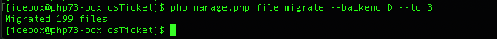

Once the command has been executed, you can look back in the database and you will notice the the :code:`bk` field now shows :code:`3` for all of the attachments since they have been migrated.

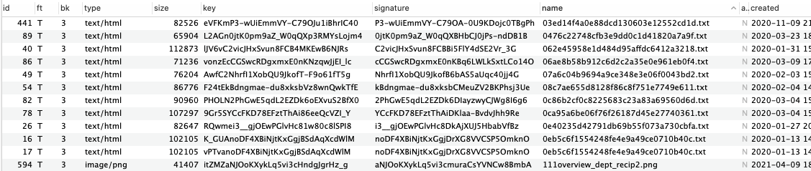
