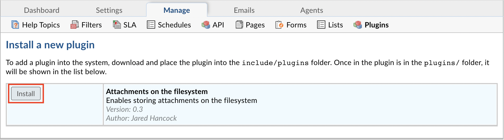
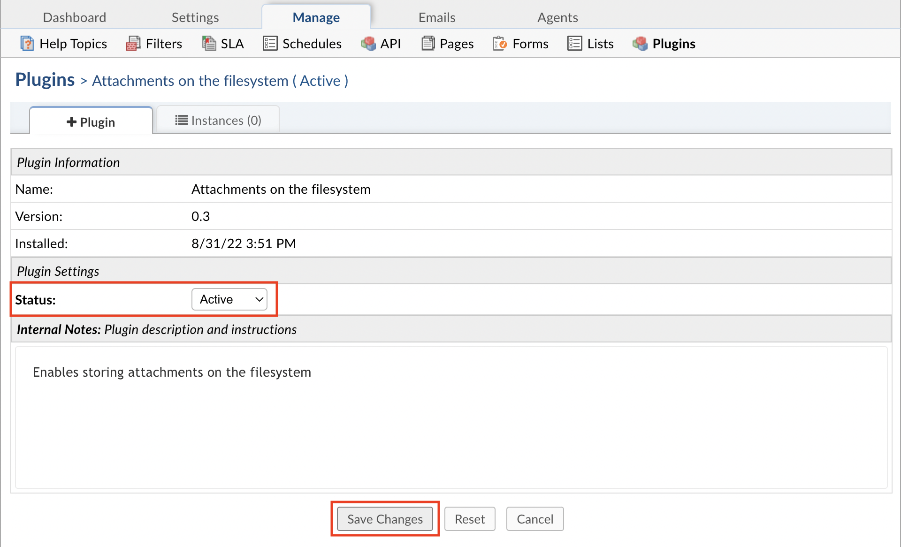
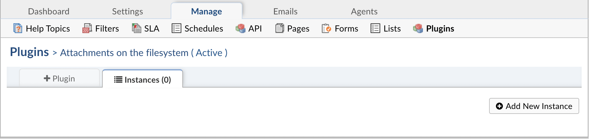
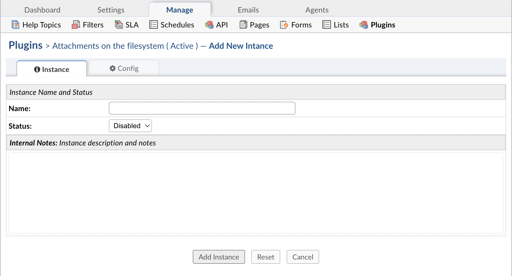

.. |br| raw:: html

     

Attachments on the Filesystem
=============================

The Attachments on the Filesystem plugin allows you to store attachments in a folder on the filesystem instead of the database.
This can be a good option to use for helpdesks that have a heavy load of attachments that are taking up a lot of storage in the database.

.. raw:: html

    

        <iframe width="560" height="315" src="https://www.youtube.com/embed/7MV1WV1gF3w" frameborder="0" allow="accelerometer; autoplay; encrypted-media; gyroscope; picture-in-picture" allowfullscreen></iframe>
    

First, you must download the plugin from `our website <https://osticket.com/download>`_. Please make sure you select the appropriate version of osTicket before proceeding to the plugin selection. Once downloaded, upload the plugin to your server and place it in the :code:`include/plugins/` folder. Make sure the plugin has appropriate file permissions and ownership so the webserver can read and execute.

Now you can install the plugin by logging into your helpdesk and navigating to **Admin Panel > Manage > Plugins**. Click **Add New Plugin** and click **Install** next to the desired plugin.

.. image:: ../_static/images/plugins_add_new.png
  :alt: Add New Plugin

|br|

To enable the plugin click on the name of the plugin in the list of installed plugins, set **Status** to **Active**, and **Save Changes**.

Once the plugin has been installed and enabled, it can be configured by going to:

Admin Panel | Manage | Plugins | Attachments on the filesystem | Instances

.. image:: ../_static/images/afs1.png
  :alt: All Plugins

|br|

To add a new instance simply click **Add New Instance**. Give the new instance any **Name** you want, set the **Status** to **Active**, and click the **Config** tab to start configuring the instance.

|br|

.. image:: ../_static/images/afs2.png
  :alt: Attachments on the filesystem Configuration

You will need to provide a folder where the attachments can be stored. You will also need to ensure that the folder can be written to.

**Note:** If the path does not start with '/' or a drive letter, it will be assumed to reside in the root folder of your osTicket files.

.. image:: ../_static/images/afs3.png
  :alt: Filesystem Folder

Once you have successfully configured the plugin, you will be able to have the helpdesk store attachments in the filesystem by going to:

Admin Panel | Settings | System | Store Attachments

Change the 'Store Attachments' option to 'Filesystem'

.. image:: ../_static/images/afs4.png
  :alt: Store Attachments Setting

|br|

.. image:: ../_static/images/afs5.png
  :alt: Save Settings

Now, when an Attachment is added in the helpdesk, it will be saved in the 'ostAttachments' folder.

.. image:: ../_static/images/afs6.png
  :alt: Open Ticket With Attachment

|br|

.. image:: ../_static/images/afs7.png
  :alt: Ticket With Attachment

|br|

.. image:: ../_static/images/afs8.png
  :alt: Attachment in Folder

If you have access to the database, you'll also notice that attachments stored in the filesystem can be found in the :code:`ost_file` table, where :code:`ost_` is your table prefix.
If the attachment is successfully stored in the filesystem, there will be an :code:`F` in the :code:`bk` column. Files stored in the database have a :code:`D` in the :code:`bk` column.

.. image:: ../_static/images/afs9.png
  :alt: Attachment in Database

If you have access to the server where the osTicket files are stored, you can see the available backends that can be used by running the following:

:code:`php manage.php file backends`

.. image:: ../_static/images/afs13.png
  :alt: Show Backends

You can migrate the files from the database to the filesystem by running the following command in the terminal:

:code:`php manage.php file migrate --backend D --to F`

Where :code:`backend` refers to the :code:`bk` column in the database, :code:`D` stands for the current backend being used, Database in this case, and :code:`F` stands for the backend you want to switch to
which is Filesystem in this example.

.. image:: ../_static/images/afs10.png
  :alt: Command in Terminal

Once the command has been run, you can look back in the database and you will notice the the :code:`bk` field now shows :code:`F` for all of the attachments since they have been migrated.

.. image:: ../_static/images/afs11.png
  :alt: Command in Terminal

The attachment folder specified will also be populated with the newly migrated files.

.. image:: ../_static/images/afs12.png
  :alt: Command in Terminal
