.. |br| raw:: html

     

Attachments on the Filesystem
=============================

The Attachments on the Filesystem plugin allows you to store attachments in a folder on the filesystem instead of the database.
This can be a good option to use for helpdesks that have a heavy load of attachments that are taking up a lot of storage in the database.

Once the plugin has been installed and enabled, it can be configured by going to:

Admin Panel | Manage | Plugins | Attachments on the filesystem

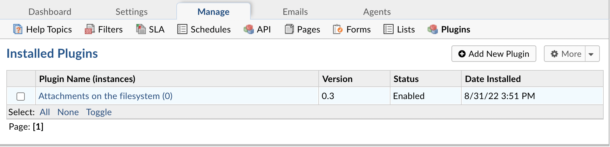

|br|

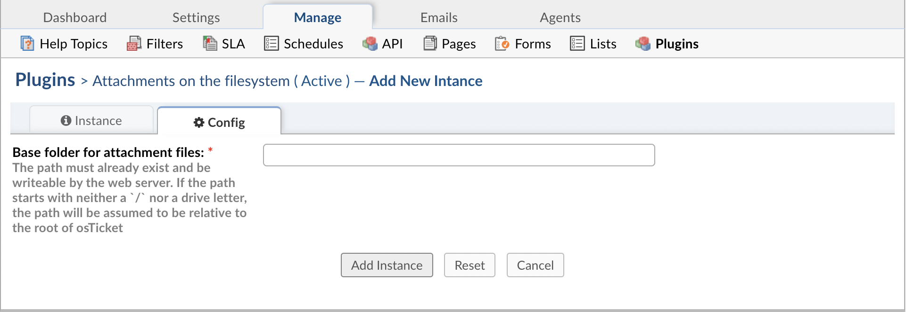

You will need to provide a folder where the attachments can be stored. You will also need to ensure that the folder can be written to.

**Note:** If the path does not start with '/' or a drive letter, it will be assumed to reside in the root folder of your osTicket files.

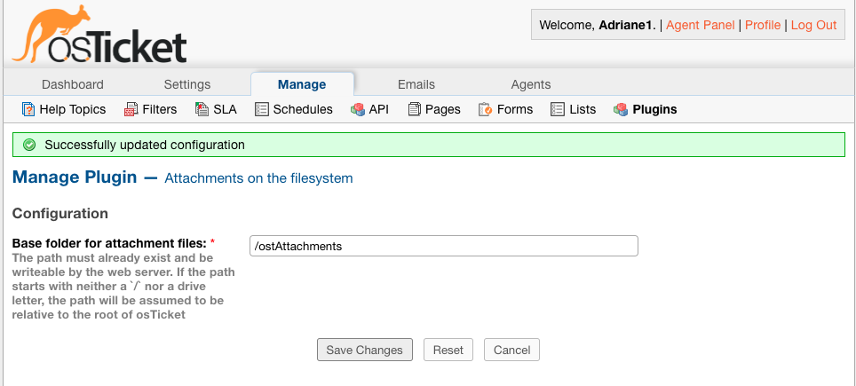

Once you have successfully configured the plugin, you will be able to have the helpdesk store attachments in the filesystem by going to:

Admin Panel | Settings | System | Store Attachments

Change the 'Store Attachments' option to 'Filesystem'

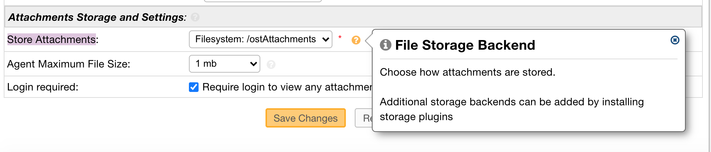

|br|

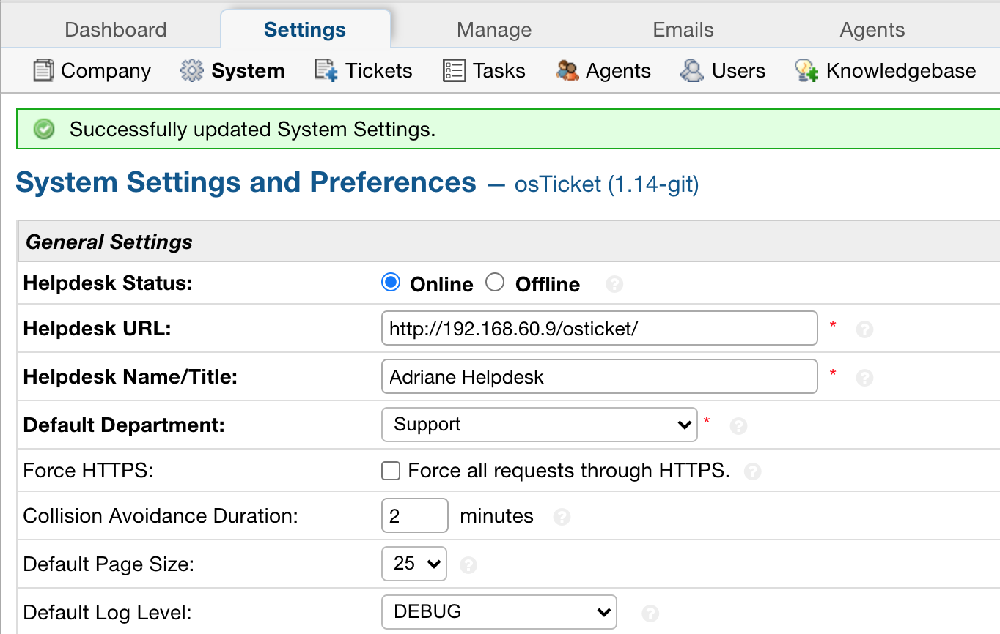

Now, when an Attachment is added in the helpdesk, it will be saved in the 'ostAttachments' folder.

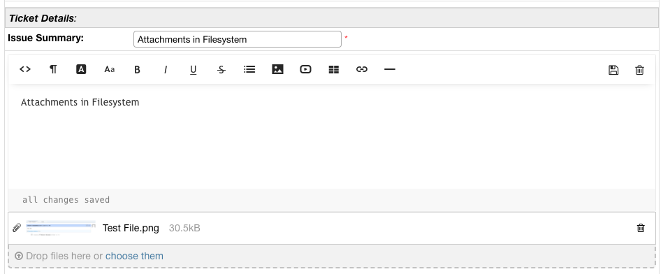

|br|

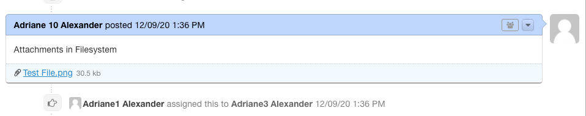

|br|

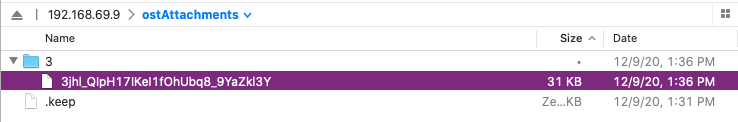

If you have access to the database, you'll also notice that attachments stored in the filesystem can be found in the ost_file table, where ost_ is your table prefix.
If the attachment is successfully stored in the filesystem, there will be an 'F' in the 'bk' column. Files stored in the database have a 'D' in the 'bk column'.

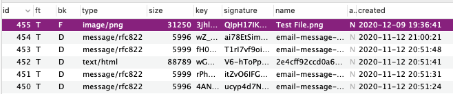

If you have access to the server where the osTicket files are stored, you can see the available backends that can be used by running the following:

:code:`php manage.php file backends`

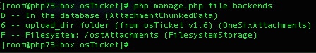

You can migrate the files from the database to the filesystem by running the following command in the terminal:

:code:`php manage.php file migrate --backend D --to F`

Where 'backend' refers to the 'bk' column in the database, 'D' stands for the current backend being used, Database in this case, and 'F' stands for the backend you want to switch to
which is Filesystem in this example.

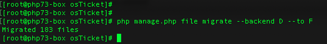

Once the command has been run, you can look back in the database and you will notice the the bk field now shows 'F' for all of the attachments since they have been migrated.

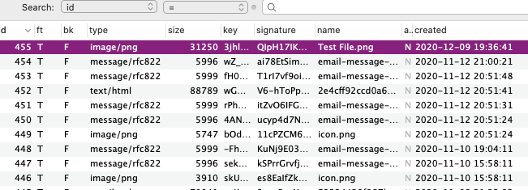

The attachment folder specified will also be populated with the newly migrated files.

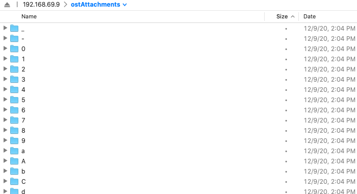
