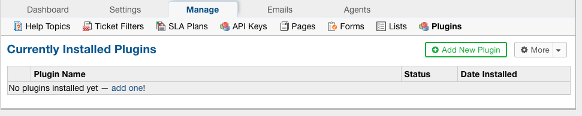
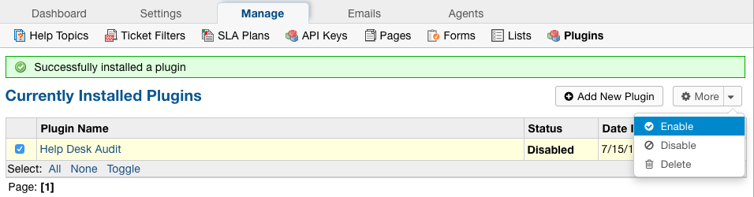

.. |br| raw:: html

     

Help Desk Audit
===============

The Audit Log plugin allows Administrators to keep track of what Agents and Users are doing in the helpdesk.
|br|
This plugin has many capabilities that will be covered below.

Plugin Setup
------------

Configuring the plugin is simple. Just download the plugin from our `website <https://osticket.com/download>`_,
|br|
copy the plugin file into the include/plugins folder, add the plugin, and enable the plugin:

Admin Panel | Manage | Plugins | Help Desk Audit

Add New Plugin
--------------

|

.. image:: ../_static/images/audit2.png
  :alt: Install New Plugin

Enable Plugin
-------------

Configure Plugin
----------------

When clicking on the plugin name, the Agent can choose whether or not they want to show the audit logs for Tickets being viewed or not.
|br|
By default, the logs for viewing Tickets will be displayed.

.. image:: ../_static/images/audit4.png
  :alt: Configure Plugin

Viewing Audits
--------------

Audits can be seen from several different places in the system. Each Audit report can be exported as a CSV.
|br|
Below are the following types of Audit reports:

#. User Audits
#. Agent Audits
#. Ticket Audits
#. Dashboard Audits

User Audits
-----------

User audits can be accessed by going to the User Directory, selecting a User, and then going to the Audits tab. From here, Agents can see every action
|br|
a User has performed on the Tickets they have access to.

.. image:: ../_static/images/audit5.png
  :alt: User Audits

Agent Audits
------------

Agent audits can be accessed by going to the Admin Panel, Agents tab, selecting an Agent, and then going to the Audits tab. From here, Agents can see every action an
|br|
Agent has performed in the system. This includes Ticket activities as well as backend activities.

.. image:: ../_static/images/audit6.png
  :alt: Agent Audits

Ticket Audits
-------------

Each Ticket has its own Audit log to show any action done on it such as changing status, transfers, referrals, field edits, etc. The Ticket Audit can be seen by going to a Ticket,
|br|
clicking the More dropdown, and selecting ‘View Audit Log’.

.. image:: ../_static/images/audit7.png
  :alt: Ticket Audits

|

.. image:: ../_static/images/audit8.png
  :alt: Ticket Audits2

Dashboard Audits
----------------

In the Dashboard Audit, Agents have more options for how to drill down the report. Agents have the option to put a date range for the report, choose which type of object to view,
|br|
and choose a specific type of event they may want to see in the report. The Dashboard Audit is accessed by going to the Admin Panel, Dashboard tab, and then Audit Logs.

Edited Tickets:

.. image:: ../_static/images/audit9.png
  :alt: Edited Tickets

All Department Events:

.. image:: ../_static/images/audit10.png
  :alt: Department Events

Tickets Created Within a Date Range:

.. image:: ../_static/images/audit11.png
  :alt: Date Range
