.. |br| raw:: html

     

Help Desk Audit
===============

The Audit Log plugin allows Administrators to keep track of what Agents and Users are doing in the helpdesk.
|br|
This plugin has many capabilities that will be covered below.

.. raw:: html

    

        <iframe width="560" height="315" src="https://www.youtube.com/embed/w5Apzfho7NM" frameborder="0" allow="accelerometer; autoplay; encrypted-media; gyroscope; picture-in-picture" allowfullscreen></iframe>
    

Plugin Setup
------------

First, you must download the plugin from `our website <https://osticket.com/download>`_. Please make sure you select the appropriate version of osTicket before proceeding to the plugin selection. Once downloaded, upload the plugin to your server and place it in the :code:`include/plugins/` folder. Make sure the plugin has appropriate file permissions and ownership so the webserver can read and execute.

Add New Plugin
--------------

Now you can install the plugin by logging into your helpdesk and navigating to **Admin Panel > Manage > Plugins**. Click **Add New Plugin** and click **Install** next to the desired plugin.

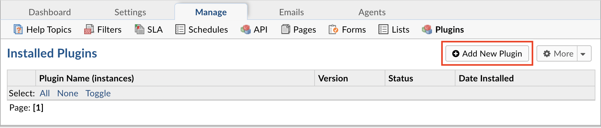

|br|

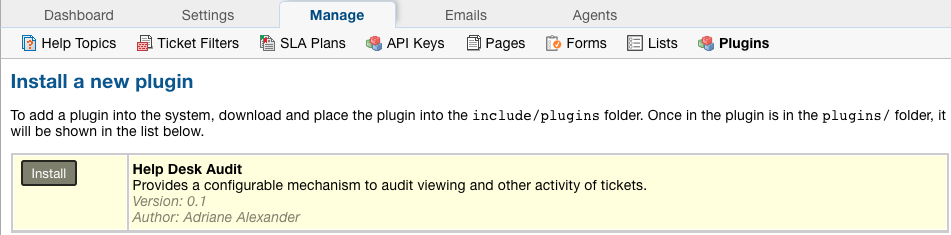

Enable Plugin
-------------

To enable the plugin click on the name of the plugin in the list of installed plugins, set **Status** to **Active**, and **Save Changes**.

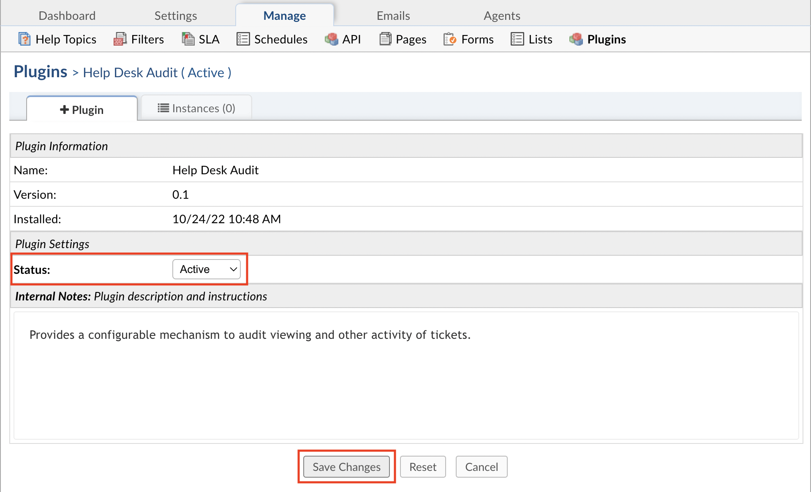

Configure Plugin
----------------

Once the plugin has been installed and enabled, it can be configured by going to:

Admin Panel | Manage | Plugins | Help Desk Audit | Instances

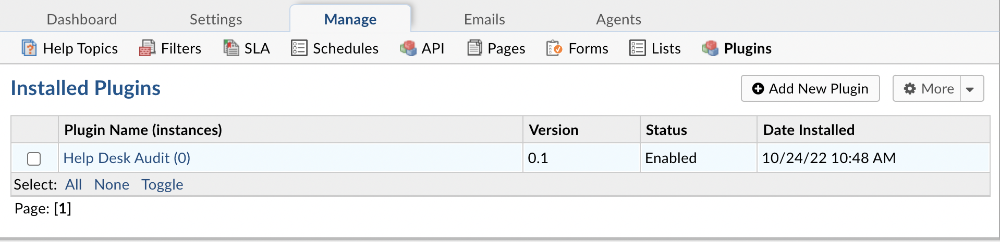

|br|

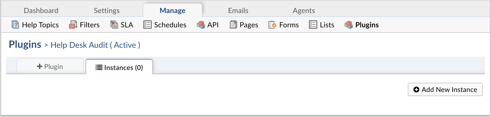

To add a new instance simply click **Add New Instance**. Give the new instance any **Name** you want, set the **Status** to **Active**, and click the **Config** tab to start configuring the instance.

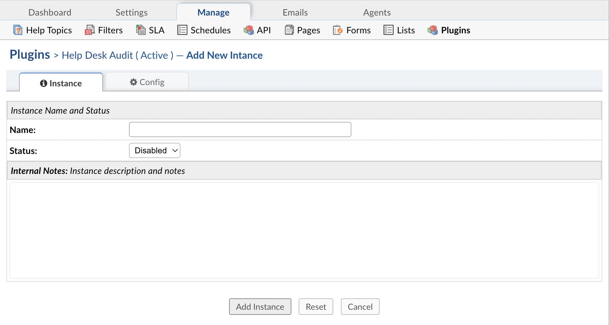

|br|

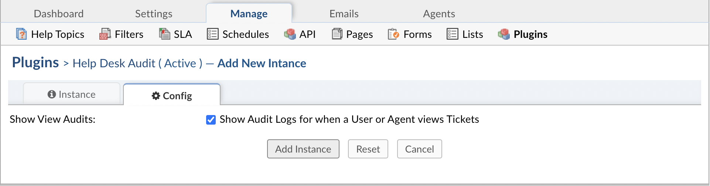

**Show View Audits** determines if the system will show the audit logs for Tickets being viewed. By default, the logs for viewing Tickets will be displayed.

Viewing Audits
--------------

Audits can be seen from several different places in the system. Each Audit report can be exported as a CSV.
|br|
Below are the following types of Audit reports:

#. User Audits
#. Agent Audits
#. Ticket Audits
#. Dashboard Audits

User Audits
-----------

User audits can be accessed by going to the User Directory, selecting a User, and then going to the Audits tab. From here, Agents can see every action
|br|
a User has performed on the Tickets they have access to.

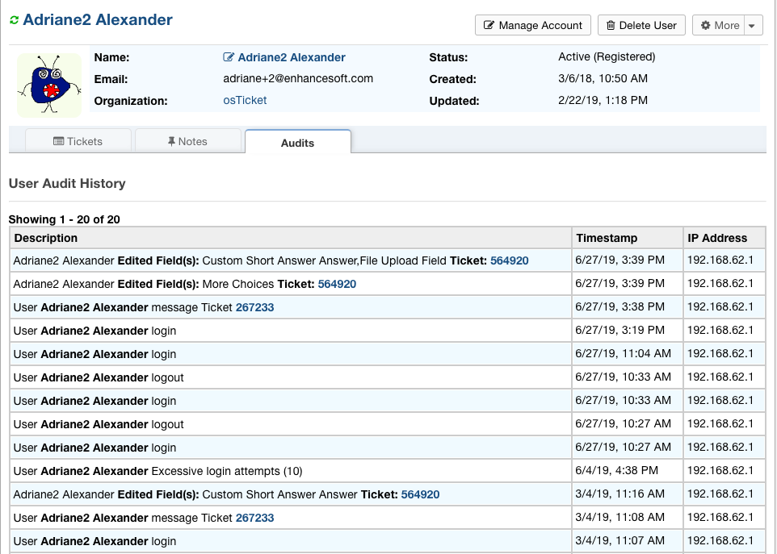

Agent Audits
------------

Agent audits can be accessed by going to the Admin Panel, Agents tab, selecting an Agent, and then going to the Audits tab. From here, Agents can see every action an
|br|
Agent has performed in the system. This includes Ticket activities as well as backend activities.

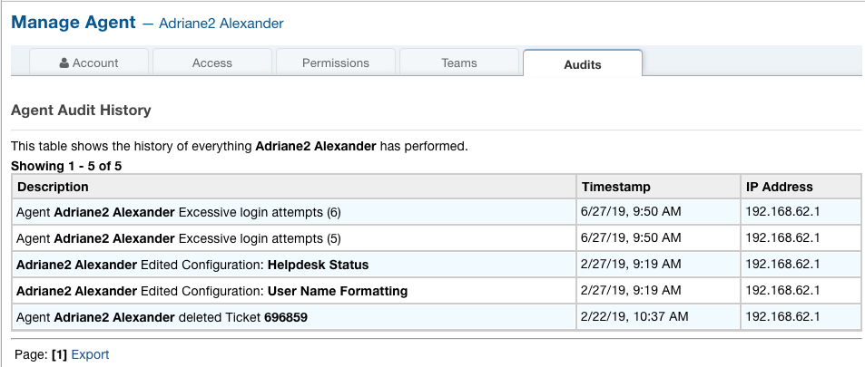

Ticket Audits
-------------

Each Ticket has its own Audit log to show any action done on it such as changing status, transfers, referrals, field edits, etc. The Ticket Audit can be seen by going to a Ticket,
|br|
clicking the More dropdown, and selecting ‘View Audit Log’.

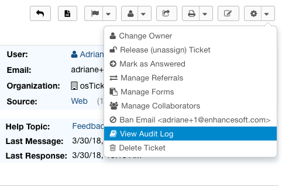

|

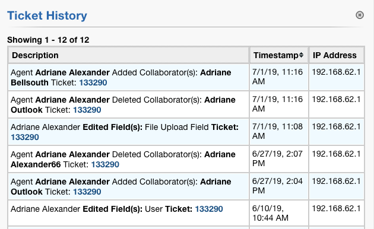

Dashboard Audits
----------------

In the Dashboard Audit, Agents have more options for how to drill down the report. Agents have the option to put a date range for the report, choose which type of object to view,
|br|
and choose a specific type of event they may want to see in the report. The Dashboard Audit is accessed by going to the Admin Panel, Dashboard tab, and then Audit Logs.

Edited Tickets:

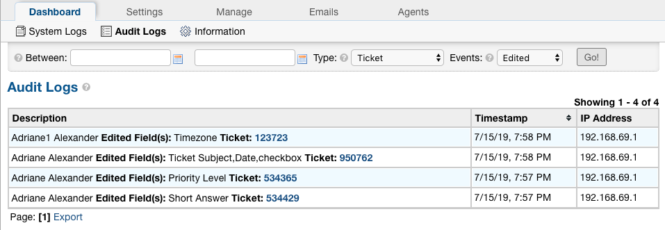

All Department Events:

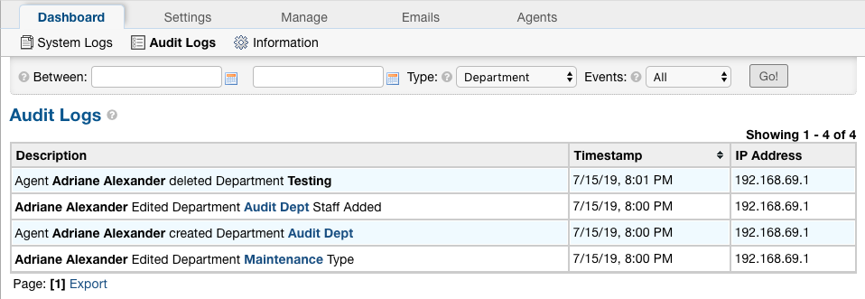

Tickets Created Within a Date Range:

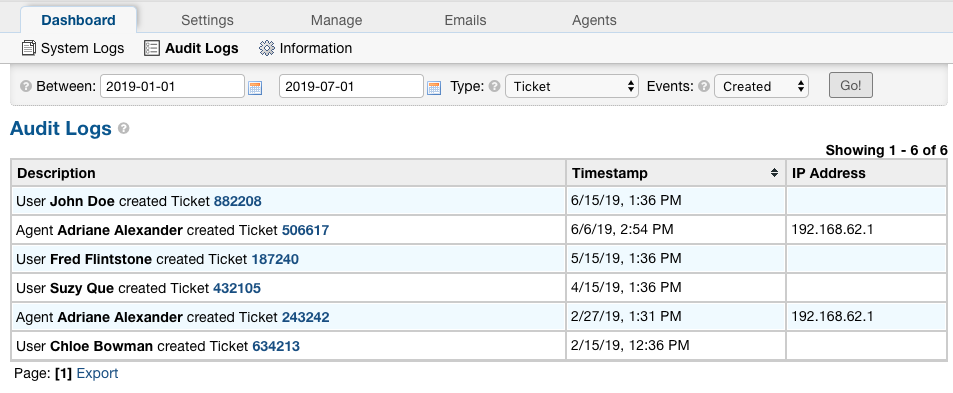
