.. |br| raw:: html

     

Password Management Policies
============================

The Password Management Policies plugin allows helpdesk Administrators to enforce custom password requirements for Agents and Users in the helpdesk.

.. raw:: html

    

        <iframe width="560" height="315" src="https://www.youtube.com/embed/JlOs7qdsHXA" frameborder="0" allow="accelerometer; autoplay; encrypted-media; gyroscope; picture-in-picture" allowfullscreen></iframe>
    

First, you must download the plugin from `our website <https://osticket.com/download>`_. Please make sure you select the appropriate version of osTicket before proceeding to the plugin selection. Once downloaded, upload the plugin to your server and place it in the :code:`include/plugins/` folder. Make sure the plugin has appropriate file permissions and ownership so the webserver can read and execute.

Now you can install the plugin by logging into your helpdesk and navigating to **Admin Panel > Manage > Plugins**. Click **Add New Plugin** and click **Install** next to the desired plugin.

.. image:: ../_static/images/plugins_add_new.png
  :alt: Add New Plugin

|br|

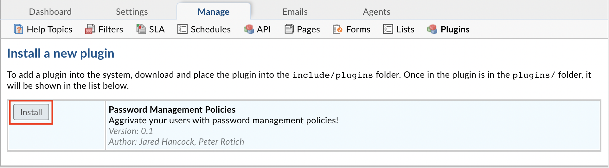

To enable the plugin click on the name of the plugin in the list of installed plugins, set **Status** to **Active**, and **Save Changes**.

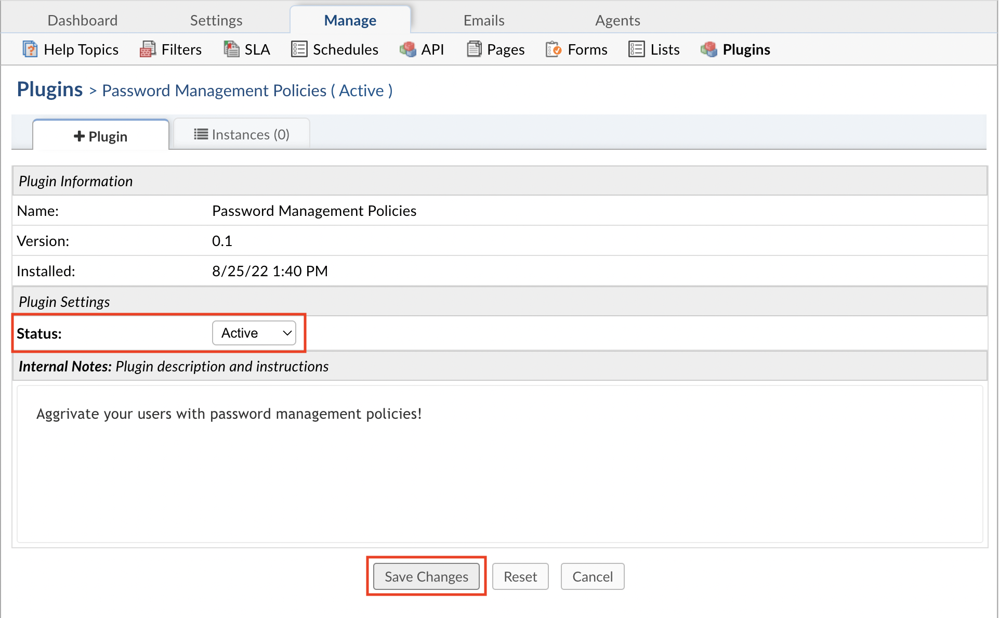

Once the plugin has been installed and enabled, it can be configured by going to:

Admin Panel | Manage | Plugins | Password Management Policies | Instances

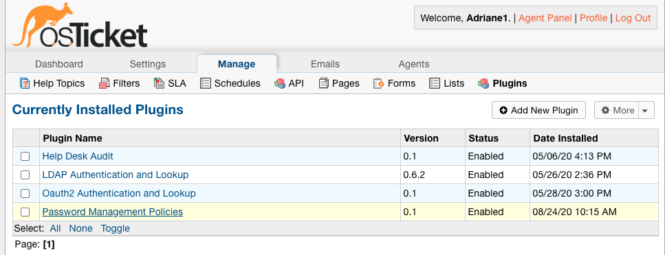

|br|

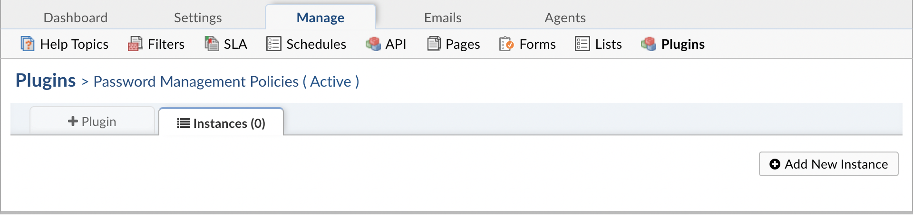

To add a new instance simply click **Add New Instance**. Give the new instance any **Name** you want, set the **Status** to **Active**, and click the **Config** tab to start configuring the instance.

.. image:: ../_static/images/pwmgt_plugin_instance.png
  :alt: Add New Password Management Policies Instance

|br|

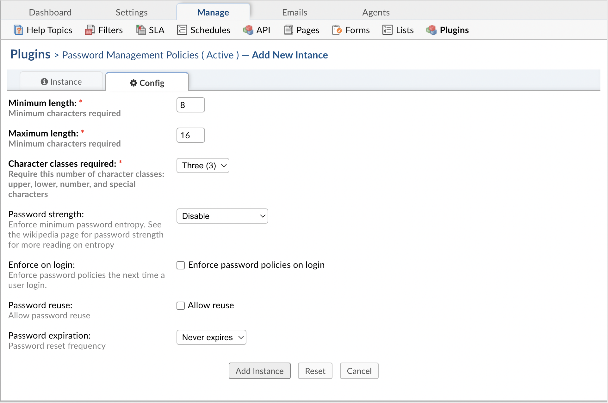

The following configurations can be set for passwords:

- `Minimum length <Minimum length_>`_
- `Character classes required <Character classes required_>`_
- `Password strength <Password strength_>`_
- `Enforce on login <Enforce on login_>`_
- `Password reuse <Password reuse_>`_
- `Password expiration <Password expiration_>`_

Minimum length
--------------
Passwords must have at least the amount of characters specified here.

Character classes required
--------------------------
The different classes referenced here are uppercase characters, lowercase characters, numbers, and special characters (Ex: @,#,$,>,etc.).
|br|
Depending on the option you choose here, (2, 3, or 4), passwords must contain characters in at least that many classes.

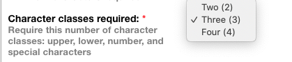

**Password with two classes:**
|br|
Password

**Password with three classes:**
|br|
Passw0rd

**Password with four classes:**
|br|
Pa$$w0rd

Password strength
-----------------

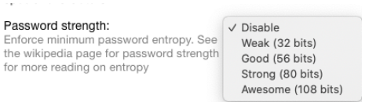

For password strength, you can choose to accept any strength, or you can choose to specify that passwords must have a strength that is at least weak, good, strong, or awesome.
|br|
The strength of a password depends on characters used, the case of characters used i.e. uppercase or lowercase, and the length of the password.
|br|
The easiest way to increase password strength is to use different `classes <Character classes required_>`_ for the characters in a passsword. The less classes used, the more the length of the password would need to be
|br|
to meet the strength requirement. You can read more about password strength `here <https://en.wikipedia.org/wiki/Password_strength#Entropy_as_a_measure_of_password_strength>`_.

Enforce on login
----------------

If you choose to enforce the password policy on login, Agents and Users will be prompted to update their password to meet the requirements of the policy before using the helpdesk.

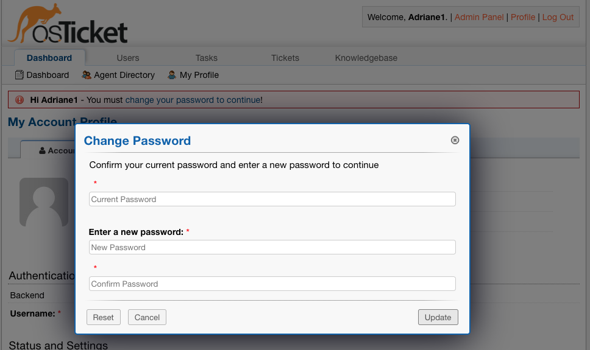

Password reuse
--------------

By default, the password policy plugin is configured to force Agents/Users to create new passwords when resetting them, however, an Administrator can check this box to allow the same password to be used multiple times.

Password expiration
-------------------

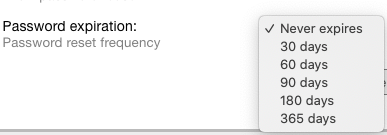

This gives Administrators the option to choose how often Agents/Users should be required to change their password. By default, this option is set to where passwords never expire.

Setting the Password Policy
---------------------------

Once the password policy has been configured, the Administrator can choose the policy for Agents and/or Users.

To use the password policy for Agents, go to:
|br|
Admin Panel | Settings | Agents | Password Policy | Password Management Plugin

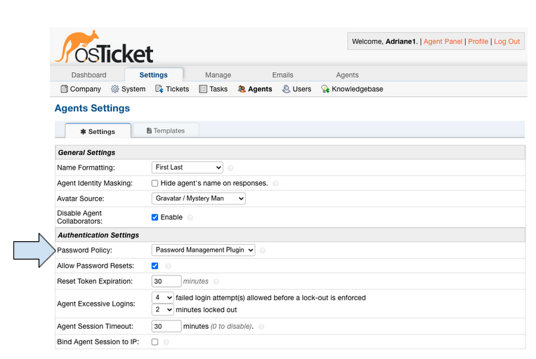

To use the password policy for Users, go to:
|br|
Admin Panel | Settings | Users | Password Policy | Password Management Plugin

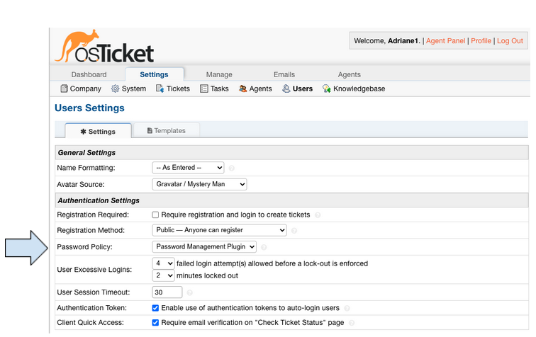

**Note:** 'Default Basic Policy' refers to the legacy policy that was put in place prior to the current version of osTicket. The previous policy allowed Administrators to set the
|br|
password expiration for Agents. If none was set up previously, passwords in the current help desk will never expire.
