.. |br| raw:: html

     

Two Factor Authentication
=========================

The Two Factor Authentication plugin allows allows Agents to use an Authenticator application
of their choice on their phone for 2FA.

.. raw:: html

    

        <iframe width="560" height="315" src="https://www.youtube.com/embed/E6O8axLZq8o" frameborder="0" allow="accelerometer; autoplay; encrypted-media; gyroscope; picture-in-picture" allowfullscreen></iframe>
    

If configured, the Agent must scan a QR code from the app, and when they go to log into
the helpdesk, they will be prompted to enter a
|br|
6-digit code displayed in the app to finish logging in.

This plugin requires downloading an Authenticator app on your phone. There are many different Authenticator apps to choose from for both Apple and Android phones. As long as the app has the ability to
use the phone's camera to scan a QR code, it should work. Popular options include:

Google Authenticator:
|br|
`Android <https://www.google.com/url?sa=t&rct=j&q=&esrc=s&source=web&cd=&cad=rja&uact=8&ved=2ahUKEwiF0Laq4qzrAhVFLK0KHWOsAfUQFjAAegQIAxAB&url=https%3A%2F%2Fplay.google.com%2Fstore%2Fapps%2Fdetails%3Fid%3Dcom.google.android.apps.authenticator2%26hl%3Den_US&usg=AOvVaw0uNewdEdn3o8Rdb2Ksudwu>`_
|br|
`Apple <https://apps.apple.com/us/app/google-authenticator/id388497605>`_

`Microsoft Authenticator <https://www.microsoft.com/en-us/account/authenticator>`_

Once the app has been installed on your smart phone, you will need to add and enable the plugin in osTicket.

Go to:

Admin Panel | Manage | Plugins | Add New Plugin

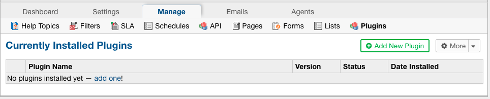

|br|

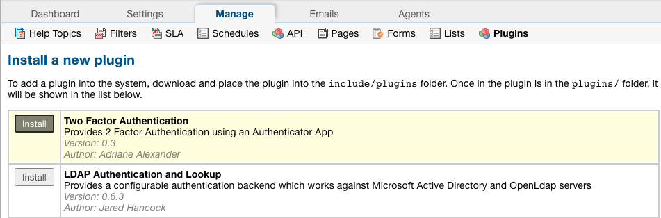

|br|

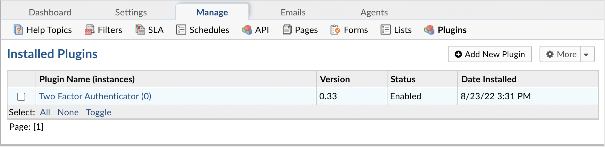

|br|

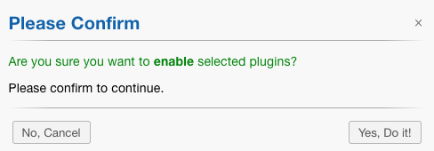

Once the plugin is enabled, Agents can configure Authenticator as their Default 2FA method by going to their profile.

Authenticator will be greyed out in the list until it has been configured.

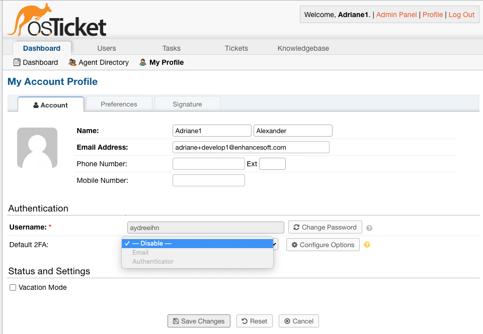

|br|

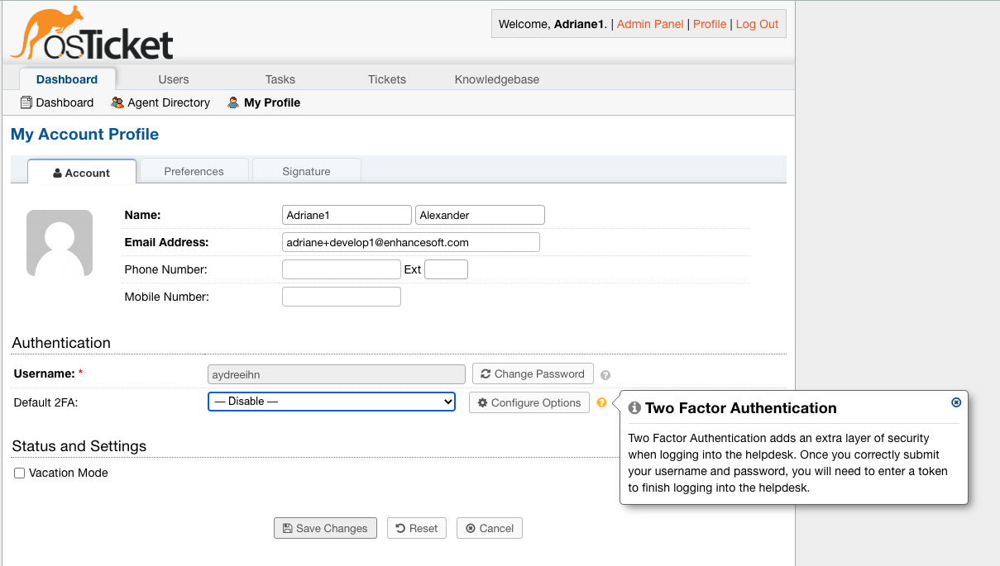

|br|

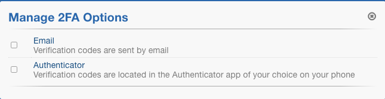

|br|

.. image:: ../_static/images/2fa7.png
  :alt: 2FA QR Code

Once you see the QR code, you will need to scan the code using an Authenticator app on your phone.

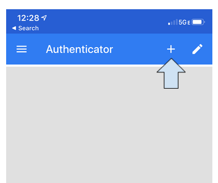

Click 'Scan barcode'.

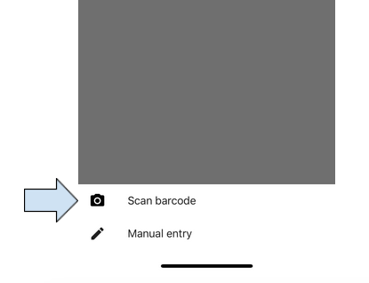

Once you have scanned the barcode, you will see an entry on the app for osTicket.

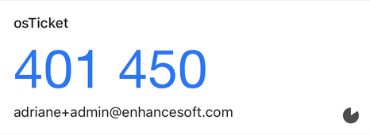

|br|

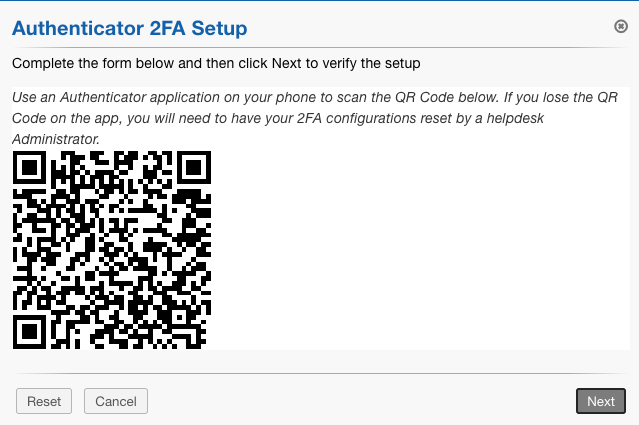

Enter the code displayed in the app and verify that it is correct.

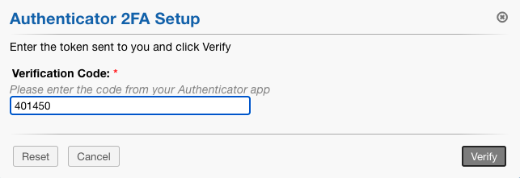

|br|

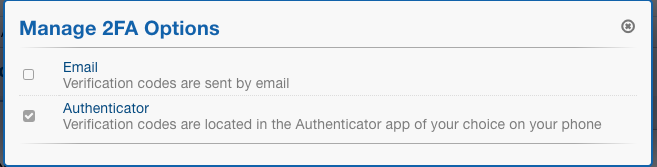

Once the configuration is complete, you can choose Authenticator as your Default 2FA method.

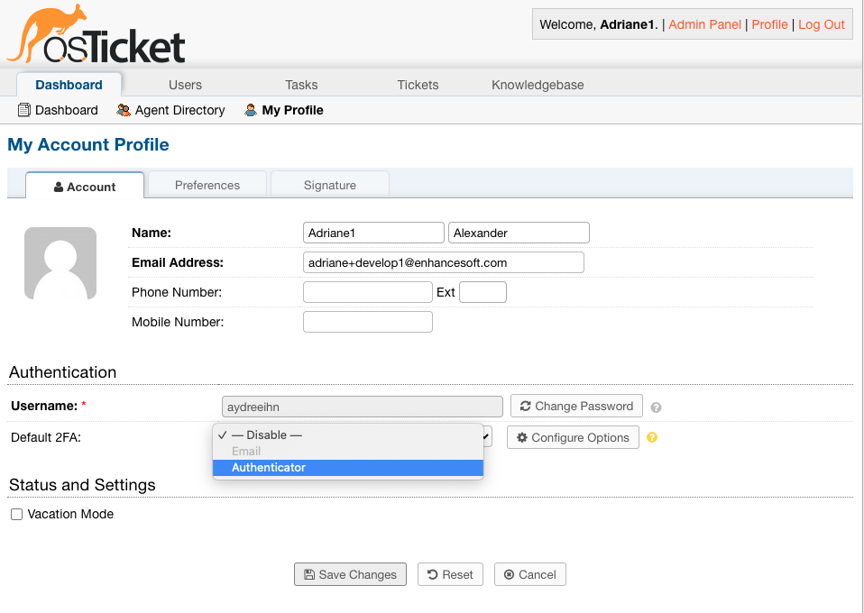

The next time you log into the helpdesk, you will be prompted to enter the code shown in your Authenticator app to finish logging into the helpdesk.

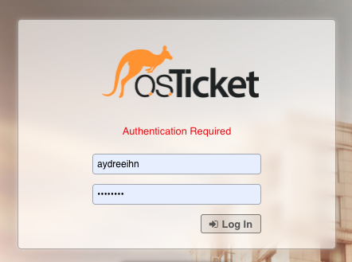

|br|

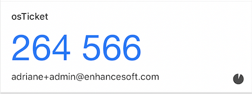

|br|

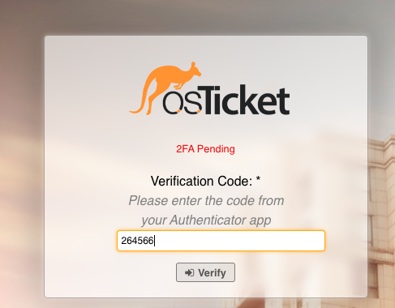

Once verfied, you will be redirected to the helpdesk.
