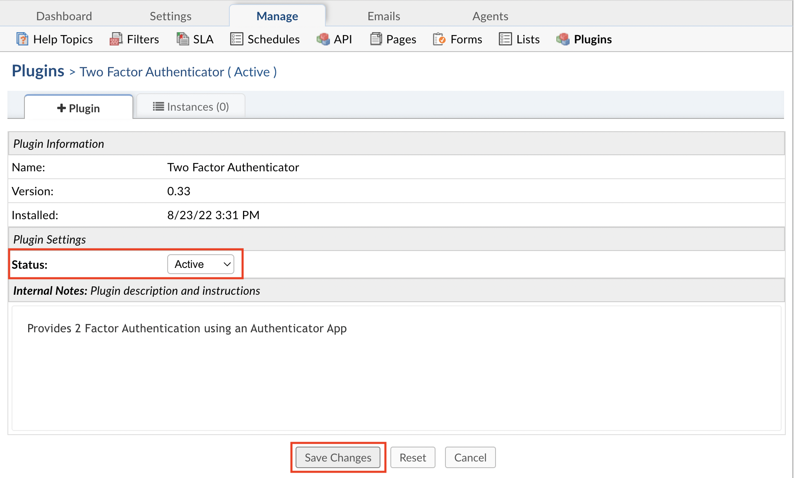
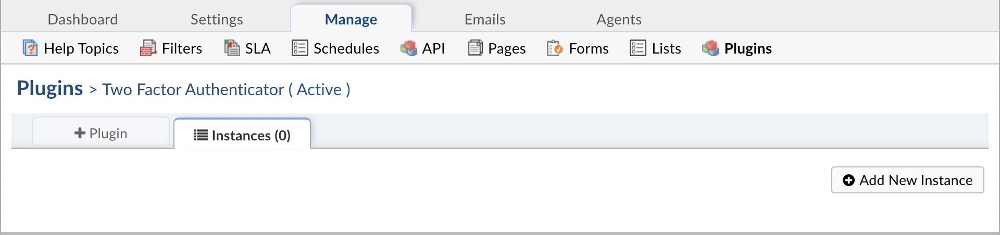
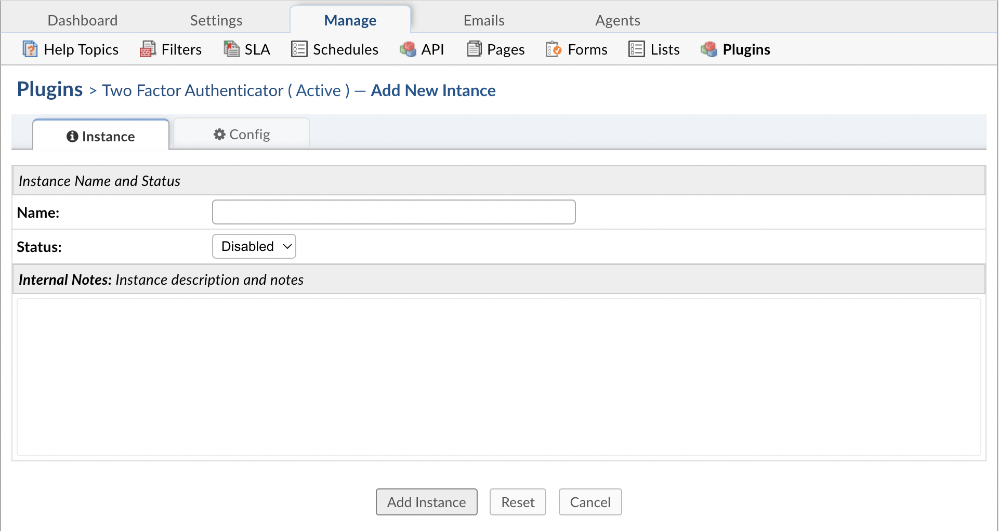

.. |br| raw:: html

     

Two Factor Authentication
=========================

The Two Factor Authentication plugin allows allows Agents to use an Authenticator application of their choice on their mobile device for 2FA.

.. raw:: html

    

        <iframe width="560" height="315" src="https://www.youtube.com/embed/E6O8axLZq8o" frameborder="0" allow="accelerometer; autoplay; encrypted-media; gyroscope; picture-in-picture" allowfullscreen></iframe>
    

If configured, the Agent must scan a QR code from the app, and when they log into the helpdesk, they will be prompted to enter a 6-digit code displayed in the app to finish logging in.

This plugin requires downloading an Authenticator app on your mobile device. There are many different Authenticator apps to choose from for both Apple and Android devices. As long as the app has the ability to use the device's camera to scan a QR code, it should work. Popular options include:

Google Authenticator:
|br|
`Apple <https://apps.apple.com/app/google-authenticator/id388497605>`_
|br|
`Android <https://play.google.com/store/apps/details?id=com.google.android.apps.authenticator2>`_

Microsoft Authenticator:
|br|
`Apple <https://go.microsoft.com/fwlink/p/?LinkID=2168643&clcid=0x409&culture=en-us&country=US>`_
|br|
`Android <https://go.microsoft.com/fwlink/p/?LinkID=2168850&clcid=0x409&culture=en-us&country=US>`_

Once the app has been installed on your mobile device, you will need to install and enable the plugin in osTicket.

First, you must download the plugin from `our website <https://osticket.com/download>`_. Please make sure you select the appropriate version of osTicket before proceeding to the plugin selection. Once downloaded, upload the plugin to your server and place it in the :code:`include/plugins/` folder. Make sure the plugin has appropriate file permissions and ownership so the webserver can read and execute.

Now you can install the plugin by logging into your helpdesk and navigating to **Admin Panel > Manage > Plugins**. Click **Add New Plugin** and click **Install** next to the desired plugin.

.. image:: ../_static/images/plugins_add_new.png
  :alt: Add New Plugin

|br|

.. image:: ../_static/images/2fa_plugin_install.png
  :alt: Install Plugin

To enable the plugin click on the name of the plugin in the list of installed plugins, set **Status** to **Active**, and **Save Changes**.

Once the plugin has been installed and enabled, it can be configured by going to:

Admin Panel | Manage | Plugins | Two Factor Authenticator | Instances

.. image:: ../_static/images/2fa3.png
  :alt: All Plugins

|br|

To add a new instance simply click **Add New Instance**. Give the new instance any **Name** you want, set the **Status** to **Active**, and click the **Config** tab to start configuring the instance.

|br|

.. image:: ../_static/images/g2fa4.png
  :alt: Two Factor Authenticator Configuration

Once the plugin is enabled, Agents can configure Authenticator as their Default 2FA method by going to their profile.

Authenticator will be greyed out in the list until it has been configured.

.. image:: ../_static/images/2fa4.png
  :alt: User Profile

|br|

.. image:: ../_static/images/2fa5.png
  :alt: User Profile

|br|

.. image:: ../_static/images/2fa6.png
  :alt: 2FA Options

|br|

.. image:: ../_static/images/2fa7.png
  :alt: 2FA QR Code

Once you see the QR code, you will need to scan the code using an Authenticator app on your mobile device.

.. image:: ../_static/images/g2fa8.png
  :alt: Add QR Code

Click 'Scan barcode'.

.. image:: ../_static/images/g2fa9.png
  :alt: Scan QR Code

Once you have scanned the barcode, you will see an entry on the app for osTicket.

.. image:: ../_static/images/g2fa10.png
  :alt: 2FA QR Code

|br|

.. image:: ../_static/images/2fa11.png
  :alt: QR Code Next

Enter the code displayed in the app and verify that it is correct.

.. image:: ../_static/images/2fa12.png
  :alt: QR Code Next

|br|

.. image:: ../_static/images/2fa13.png
  :alt: Setup Complete

Once the configuration is complete, you can choose Authenticator as your Default 2FA method.

.. image:: ../_static/images/2fa14.png
  :alt: Choose 2FA

The next time you log into the helpdesk, you will be prompted to enter the code shown in your Authenticator app to finish logging into the helpdesk.

.. image:: ../_static/images/g2fa15.png
  :alt: Help Desk Login

|br|

.. image:: ../_static/images/g2fa16.png
  :alt: 2FA Code

|br|

.. image:: ../_static/images/2fa17.png
  :alt: Enter 2FA Code

Once verfied, you will be redirected to the helpdesk.
