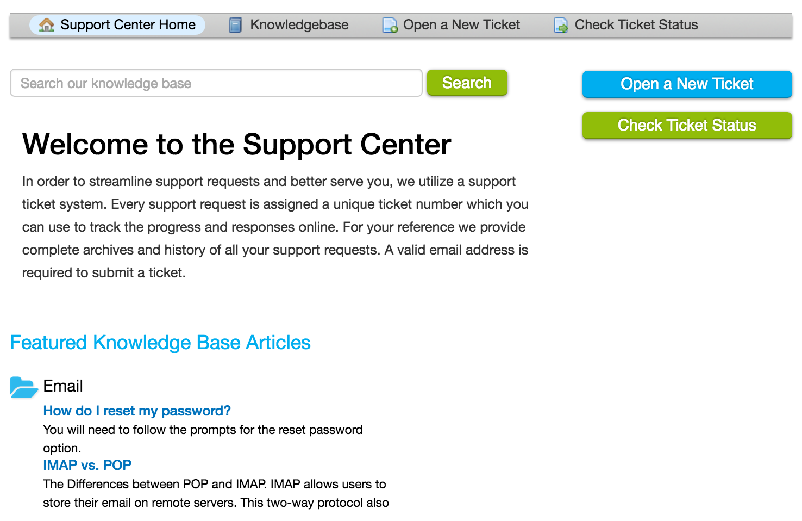

Knowledgebase
=============

Knowledgebase articles are a convenient way for the support team to share information. By pre-populating articles with help topics relating to FAQ’s, clients are able to help themselves with more common issues that arise to reduce wait time and make happy customers. Knowledgebase articles may be posted on the main page of the help desk or you may be required to login for access to them.

Knowledgebase articles can be located by following the article links at the bottom of the main page or by clicking on the “Knowledgebase” button at the top of the page.
