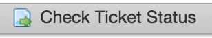
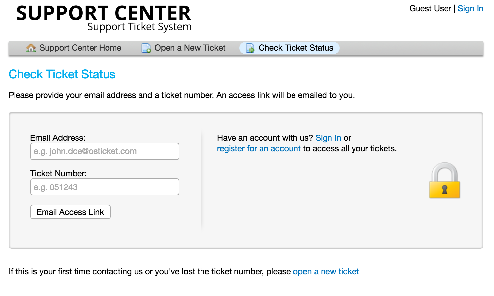
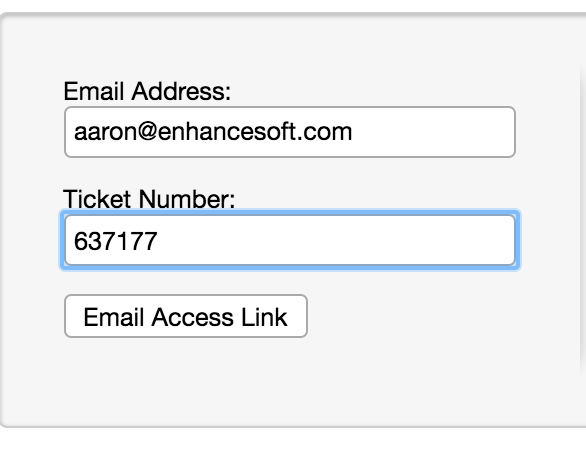
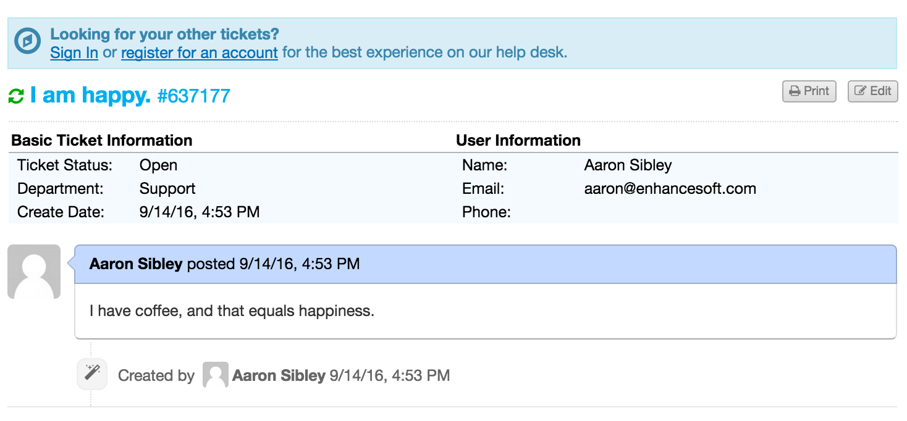
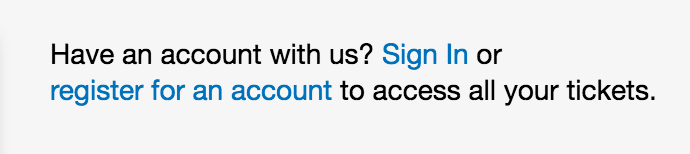
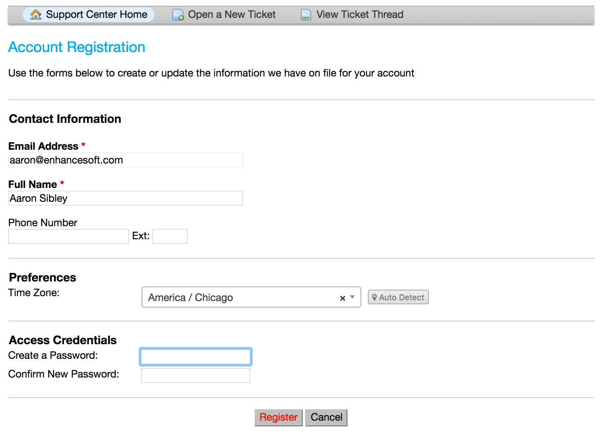
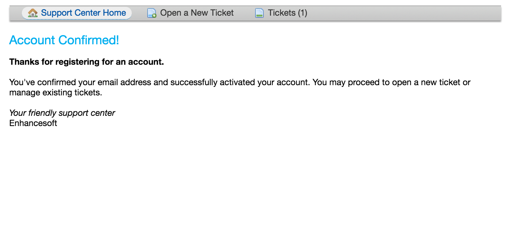
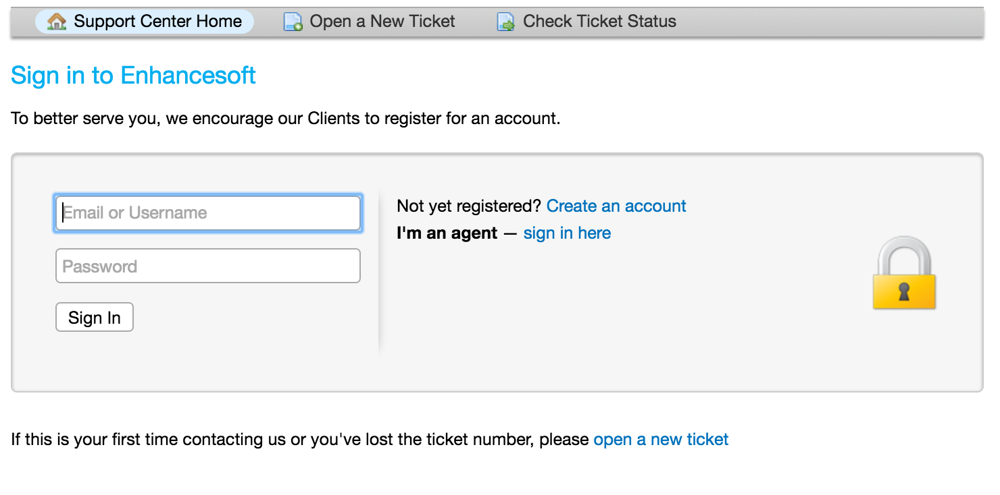
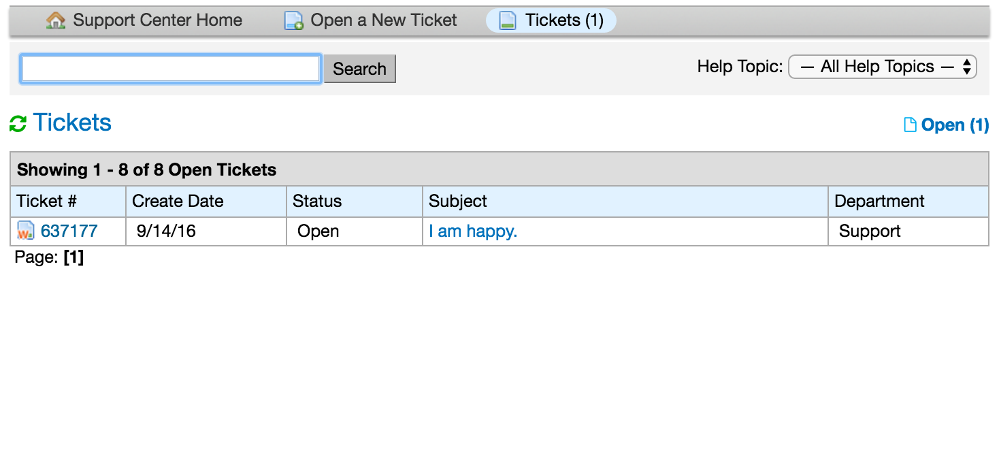

Check Ticket Status
===================

Using Email Address & Ticket Number
-----------------------------------

To check a ticket status, visit the main page of the help desk just as when you opened the ticket. You will select one of the two “Check Ticket Status” buttons.

.. image:: ../../_static/images/user_ticket_stat_welcome.png
  :alt: Client Portal

You will be redirected to the check ticket status page where you can access the ticket status information.

Once those details are provided, the email address associated with the user account will receive an access link to the ticket thread.

With User Account
-----------------

Another way to check the status of a ticket is to log in directly to the system to access all of your tickets. In order to do this, you will need to create a user account by clicking on register for an account.

Once you have completed the registration process, you will need to follow the email link that you receive to confirm the account.

To login, simply visit the main portal for the help desk and enter the credentials that you registered with.

The benefit of creating a user account is that all tickets associated with your account will be listed in the ticket queue.

