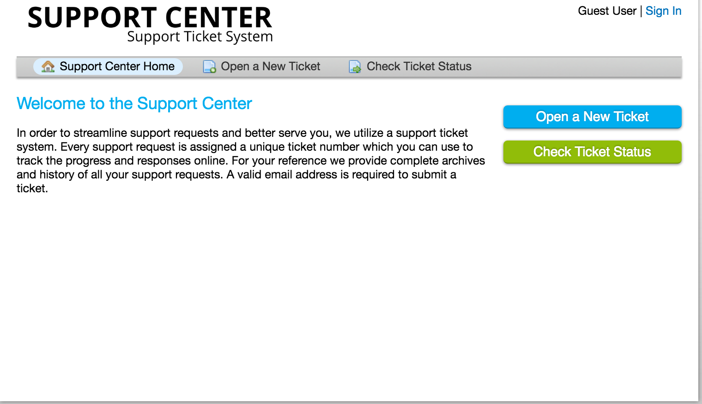
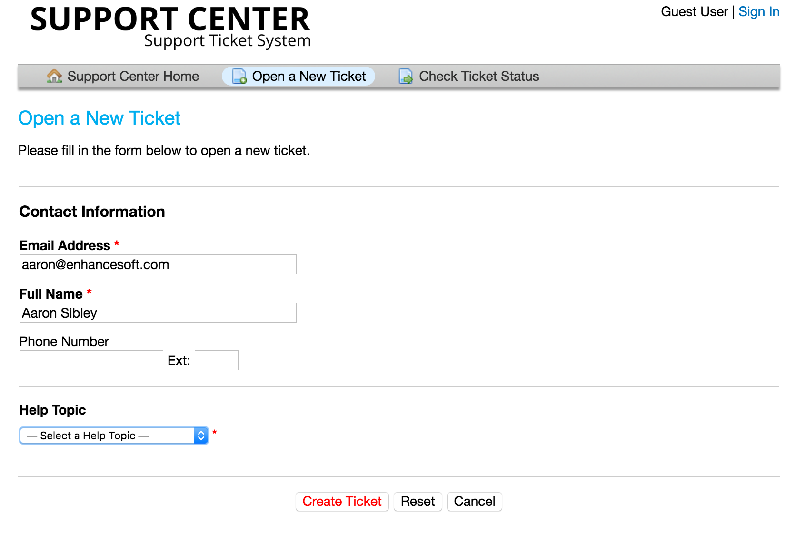
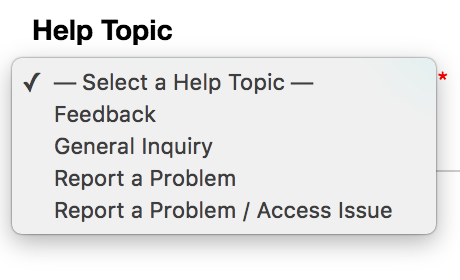
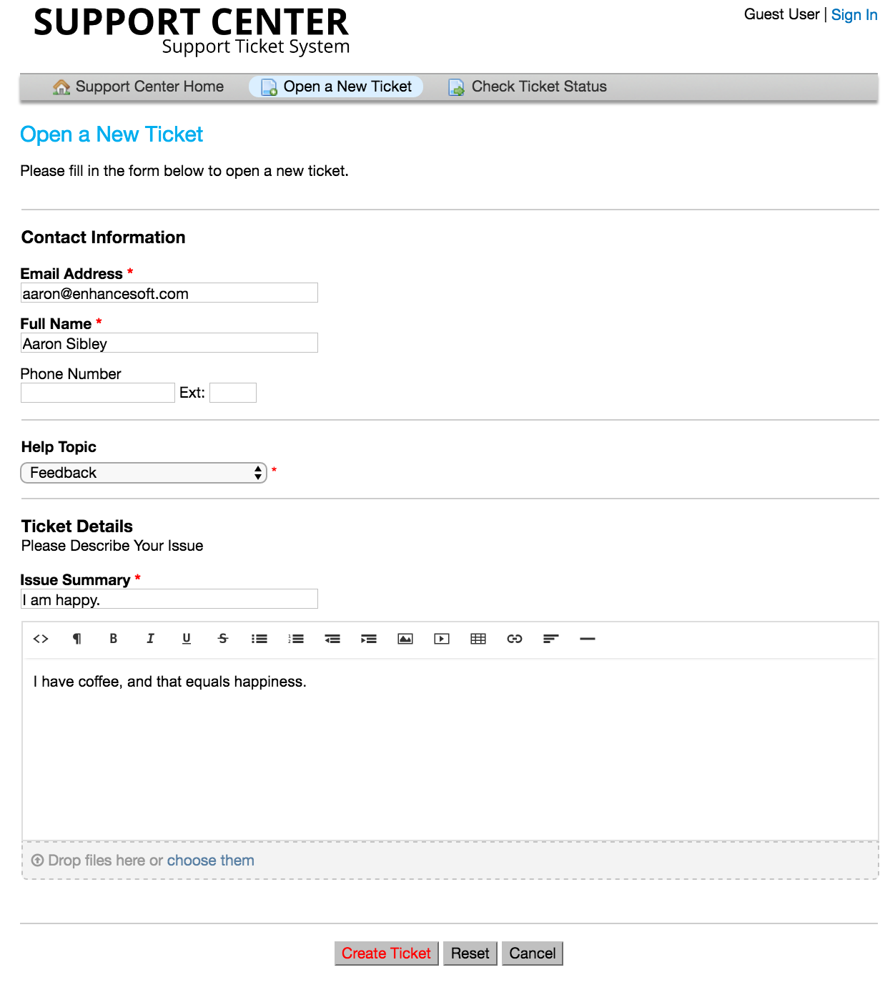
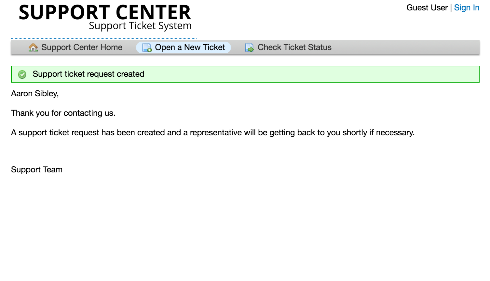

Open A Ticket
=============

To open a new ticket, you will need to visit the client portal page of the help desk. Once you have arrived at that page, click on one of the two “Open a New Ticket” buttons.

When you click the button, you will be redirected to a blank ticket form, where you can share the required contact detail fields for the ticket, i.e., email address, the name of the ticket owner, phone number, etc.

In addition, you will see a Help Topics field. By choosing a help topic, you are able to direct and streamline the information you are submitting to the help desk.

(Please note that the help desk you are contacting may have a much more thorough and unlimited population of help topics than what you see here.)

Select the appropriate help topic relating to the issue that you are experiencing. Make a brief description in the issue summary - think of this like the subject line of an email. Share as much detail as you would like in the body of the message. Use the HTML Rich Text toolbar to format your message, upload and share photos and videos, and attach hyperlinks. When you have completed filling out your ticket, be sure to click the “Create Ticket” button.

Once you have successfully created the ticket, you will be directed to a confirmation of the ticket request being created.

